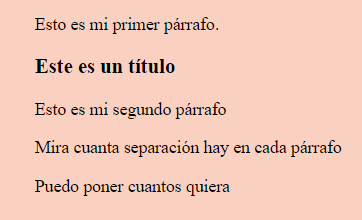

# 1.  

## *Introducción*
Para la elaboración de nuestras web-app utilizaremos el lenguaje de marcado de hipertexto o HTML. HTML es el lenguaje que utilizaremos como base, ya que es el estándar que se ha impuesto en todos los navegadores. Este lenguaje de marcado fue desarrollado por la World Wide Web Consortium (W3C), la organización que se encarga de la estandarización de las distintas tecnologías web. 

Se le dice lenguaje de marcado porque en su estructura se utilizan etiquetas, que son interpretadas por el navegador. La sintaxis de las etiquetas es la siguiente: 

      <etiqueta de apertura> texto que irá dentro de la etiqueta </etiqueta de cierre>

Como ves, la etiqueta de apertura lleva el símbolo (<) para abrir la etiqueta y el símbolo (>) para cerrarla. La diferencia con la etiqueta de cierre, es que a esta última le indicamos que es de cierre con la barra diagonal (/). 

En este curso estudiaremos la última versión de HTML: HTML5, ya que es la versión más actual que cuenta con nuevos elementos y atributos.  

En esta primera clase, veremos las etiquetas más comunes que podemos encontrarnos en HTML5. 

## *Teoría*

## Estrutura general de un documento HTML

La estructura general de un archivo html es la siguiente: 

<!DOCTYPE html>
<html lang="en">
<head>
    <meta charset="UTF-8">
    <meta http-equiv="X-UA-Compatible" content="IE=edge">
    <meta name="viewport" content="width=device-width, initial-scale=1.0">
    <title>Document</title>
</head>
<body>
    
</body>
</html>

- **\<!DOCTYPE html>**: con ello le indicamos que este es un archivo html.
- **\<html lang="en">**: con esta etiqueta le estamos indicando el idioma en que escribiremos la página. 
- **\<head>**: utilizamos esta etiqueta para incluir todas las etiquetas meta, el título del ducmento, las hojas de estilo(CSS)... 
- **etiquetas meta**: vienen por defecto al crear el documento y debemos incluirlas para que nuestro HTML se comporte correctamente. 
- **\<title>Document</title>**: sirven para indicar el título del documento que aparecerá en la barra del navegador.
- **\<body>**: en el incluiremos la estructura del nuestro HTML con todas las etiquetas que veremos próximamente. 

## Encabezados 
***
Los encabezados HTML son títulos o subtítulos que aparecen en cualquier página web. Se representan con una etiqueta de apertura o inicial y una etiqueta de cierre o final.

Se utilizan para señalar el tema de la sección que aparecerá en la página. Dado que hay distintos niveles de importancia entre los títulos y subtítulos que hay en una página, se representan por niveles que van del 1 al 6, siendo 1 el que tiene más importancia y 6 el que menos. Todos ellos se representan con la letra h.

Es importante saber que al ir por orden de importancia, su estilo también cambia, por lo que desde \<h1> el tamaño de su fuente se reduce, lo que nos permite representar de forma gráfica los niveles de relevancia dentro de nuestra web.

#### ¿Cómo escribirlo en código?

```html
      <h1>El título más importante</h1>
      <h2>El segundo título más importante</h2>
      <h3>El tercer título más importante</h3>
      <h4>El cuarto título más importante</h4>
      <h5>El quinto título más importante</h5>
      <h6>El sexto título más importante</h6>
```

#### ¿Cómo se vería representado?


#### Recursos

[Encabezados | w3schools](https://www.w3schools.com/html/html_headings.asp)  
[Encabezados | Mozilla Developer](https://developer.mozilla.org/es/docs/Web/HTML/Element/Heading_Elements)


## Párrafos 
***
En nuestra web envolveremos cada párrafo con una etiqueta de apertura \<p> y una de cierre \</p>. El número de párrafos que podemos poner es el que deseemos y cada párrafo estará separado de la anterior etiqueta por un margen antes y después.

#### ¿Cómo escribirlo en código?

```html
      <p>Esto es mi primer párrafo. </p>
      <h3>Este es un título</h3>
      <p>Esto es mi segundo párrafo</h3>
      <p>Mira cuanta separación hay en cada párrafo</p>
      <p>Puedo poner cuantos quiera</p>
```

#### ¿Cómo se vería representado?



#### Recursos
[Párrafos | w3schools](https://www.w3schools.com/html/html_paragraphs.asp)  
[Párrafos | Mozilla Developer](https://developer.mozilla.org/es/docs/Web/HTML/Element/p)


## Formato de texto
***
En HTML podemos dar distintos formatos. Al igual que si se tratara de un documento de texto, podemos aplicarle negrita, subrayado, destacar palabras o frases importantes... Para dar este tipo de formato, se utilizan una serie de etiquetas que nos brinda HTML, y su función es la de envolver entre ellas las palabras a las que queremos aplicar este formateo. Las etiquetas más utilizadas para formatear texto en HTML son las siguientes:

- **\<i>\</i>**: hacen que el texto que envolvemos entre estas etiquetas aparezca en cursiva.

- **\<b>\</b>**: hacen que el texto que envolvemos entre estas etiquetas aparezca en negrita.

- **\<strong>\</strong>**: señalan un texto importante. Sirve para enfatizar sobre dicha palabra.

- **\<em>\</em>**: sirve para enfatizar el texto que envuelve.

- **\<mark>\</mark>**: sirve para resaltar</b> un texto. Sería como si subrayaramos un texto con un marcador.

- **\<small>\</small>**: se utiliza para hacer un texto más pequeño respecto al tamaño original de nuestro texto.

- **\<del>\</del>**: sirve para representar un texto eliminado. De forma visual se verá un texto tachado.

- **\<ins>\</ins>**: al contrario que la etiqueta del, esta etiqueta representa un texto que ha sido añadido a la página, viéndose de forma visual con un subrayado.

- **\<sub>\</sub>**: se utiliza para poner subíndices, como por ejemplo, en notación científica: "CO2".

- **\<sup>\</sup>**: se utiliza para poner superíndices, como por ejemplo, en notas de pie de página.

- **\<abbr>\</abbr>**: lo utilizaremos cuando queremos poner abreviaturas que solo se verán si pasamos el ratón por encima.

- **\<address>\</adress>**: utilizaremos esta etiqueta para representar información de contacto.

- **\<time>\</time>**: lo utilizamos para que nuestra máquina reconozca que es una fecha o una hora.

#### ¿Cómo escribirlo en código?

```html
      - <i></i>: <p>Aquí una palabra en <i>cursiva</i></p>
      - <b></b>: <p>Aquí una palabra en <b>negrita</b></p>
      - <strong></strong>: <p>Aquí una palabra <strong>enfatizada</strong> a la que queremos dar importancia</p>
      - <em></em>: <p>Aquí una palabra <em>enfatizada</em></p>
      - <mark></mark>: <p>Aquí una palabra <mark>marcada</mark></p>
      - <small></small>: <p>Aquí una palabra <small>pequeña</small></p>
      - <del></del>: <p>Aquí una palabra <del>eliminada</del></p>
      - <ins></ins>: <p>Aquí una palabra <ins>insertada</ins></p>
      - <sub></sub>: <p>Aquí un subíndice en CO2: CO<sub>2</sub></p>
      - <sup></sup>: <p>Aquí un superíndice en EMT1: EMT<sup>1</sup></p>
      - <abbr></abbr>: <p>Aquí la abreviatura de CSS: <abbr title="Cascading Style Sheet">CSS</abbr></p>
      - <address></adress>: <p>Aquí una dirección: <address>Nemo, P. Sherman, Calle Wallaby 42, Sidney</adress></p>
      - <time></time>: <p>Son las <time datatime="20:00">20:00</time> del día <time datatime="2020-01-02">January 2</time></p>
```

#### ¿Cómo se vería representado?


#### Recursos

[Formato de texto | w3schools](https://www.w3schools.com/html/html_formatting.asp)  
[Formato de texto | Mozilla Developer](https://developer.mozilla.org/es/docs/Learn/HTML/Introduction_to_HTML/Advanced_text_formatting)


## Citas 
***
En HTML puede existir texto al que le quedáramos dar forma de cita. Para ello, existen tres etiquetas distintas que podemos utilizar según nuestras necesidades:

-**\<blockquote>\</blockquote>**: esta primera se utiliza en el caso de que citemos una fuente externa. Por ello, tenemos que utilizar esta etiqueta con el atributo "cite".

- **\<q>\</q>**: la utilizaremos en el caso de que queramos escribir una cita breve. El navegador se encarga de encomillarla.

- **\<cite>\</cite>**: esta etiqueta se usa para citar obras como libros, poemas, canciones... El navegador pondrá el texto que envuelve en cursiva.

#### ¿Cómo escribirlo en código?

```html
      - <blockquote cite="https://es.wikipedia.org/wiki/Programaci%C3%B3n">La programación es el proceso utilizado para idear y ordenar las acciones necesarias para realizar un proyecto, preparar ciertas máquinas o aparatos para que empiecen a funcionar en el momento y en la forma deseados o elaborar programas para su empleo en computadoras.</blockquote>

      - <q>Solo se que no se nada</q>

      - <p><cite>El Señor de los Anillos</cite> por J.R.R. Tolkien</p>
```

#### ¿Cómo se vería representado?


#### Recursos

[Citas | w3schools](https://www.w3schools.com/html/html_quotation_elements.asp)  
[Citas | Mozilla Developer](https://developer.mozilla.org/es/docs/Web/HTML/Element/blockquote)


## Listas
***
También puede existir el caso en que queramos agrupar una serie de elementos dentro de una lista. Ahí es donde tenemos que distinguir entre listas desordenadas, ordenadas y descriptivas. Las dos primeras llevarán dentro de ellas, una etiqueta de apertura \<li> y una etiqueta de cierre \</li>, según el número de elementos que queramos poner dentro de ellas.

- **\<ol>\</ol>**: esta etiqueta se utiliza para las **listas ordenadas**. En el navegador aparecerán ordenadas por números de forma descendente.

- **\<ul>\</ul>**: podemos usar estas etiquetas para poner una **lista desordenada**. Según los niveles, aparecerán representadas con unos elementos u otros.

- **\<dl>\</dl>**: este tipo de lista se utiliza cuando queremos dar una definición o descripción de los elementos.

#### ¿Cómo escribirlo en código?

```html
      <ol>Ganadores del premio 
            <li>Yo</li> 
            <li>Tú</li> 
            <li>Él</li>
      </ol>

      <ul>Lista de la compra
            <li>Tomates</li> 
            <li>Peras</li> 
            <li>Peras</li>
            <li>Manzanas</li>
      </ul>

      <dl>Lenguajes de programación
            <dt>HTML</dt>
                  <dd>HyperText Markup Language</dd> 
            <dt>CSS</dt>
                  <dd>Cascading Style Sheets</dd>
      </dl>
```

#### ¿Cómo se vería representado?


### Recursos

[Listas | w3schools](https://www.w3schools.com/html/html_lists.asp)  
[Listas | Mozilla Developer](https://developer.mozilla.org/es/docs/Learn/Getting_started_with_the_web/HTML_basics#listas)


## Comentarios 
*** 
Entre las bondades que nos ofrece la programación, está la de los comentarios, que nos sirven para documentar o poner pequeñas anotaciones que nos puedan servir para clarificarnos u organizarnos. Estos comentarios no se muestran en el navegador, por lo que todo lo que esté dentro del comentario, solo aparecerá al inspeccionar la página o en los editores de código.

Se utiliza como elemento de apertura: \<!-- y como elemento de cierre \- ->

#### ¿Cómo escribirlo en código?
    \<!-- Este es un comentario \-->

#### ¿Cómo se vería representado?

No se vería representado, ya que los comentarios solo se utiliza en el código. 

#### Recursos

[Comentarios | w3schools](https://www.w3schools.com/html/html_comments.asp)  
[Comentarios | Mozilla Developer](https://developer.mozilla.org/es/docs/Web/CSS/Comments)


## Atributos
***
Los atributos son palabras que añadimos dentro de las etiquetas, dándole el valor que nosotros necesitemos o la etiqueta requiera.

Una etiqueta puede tener o no tener atributo. Que tenga o no depende de cómo está construida la etiqueta, ya que hay algunas que no lo requieren, como por ejemplo los \<h1> los \<p>, las etiquetas de formato... Y otras que sí, como \<time datatime="">, \<blockquote cite="">...

Los atributos suelen tener un valor, es decir, vienen en un par, de nombre, que es el atributo y su valor: nombre = "valor". Por ejemplo: \<a href="https://www.google.es/">Google\</a>

Los elementos en HTML tienen atributos. Se trata de valores adicionales que configuran los elementos o ajustan su comportamiento de diversas formas.

#### Recursos

[Atributos | w3schools](https://www.w3schools.com/html/html_attributes.asp)


## Elementos de línea y elementos de bloque
***
Las etiquetas ocupan un espacio determinado dependiendo de si son elementos de línea y elementos de bloque.

- Los elementos **en línea** ocupan el espacio que ocupa el texto/imagen/video que hay dentro de la etiqueta.

- Los elementos **en bloque** ocupan todo el ancho de la página y también tiene un pequeño margen en la parte de arriba y de abajo.

La diferencia principal entre el uno y el otro es que los elementos en línea al ocupar solo el espacio que ocupa el texto, pueden ir en una misma línea, a diferencia de los de bloque, que al poner la etiqueta empiezan en una nueva línea.

Existen una gran cantidad de elementos en bloque. Puedes investigarlos en los recursos que te adjuntamos.

#### ¿Cómo escribirlo en código?

```html

      <p>Este es un <i>texto</i> en <b>línea</b></p>
      <div>Este es un texto <p>En bloque</p></div>
```

#### ¿Cómo se vería representado?


#### Recursos

[Elementos en línea y en bloque | w3schools](https://www.w3schools.com/html/html_blocks.asp)  
[Elementos en línea y en bloque | Mozilla Developer](https://developer.mozilla.org/es/docs/Web/HTML/Block-level_elements)


