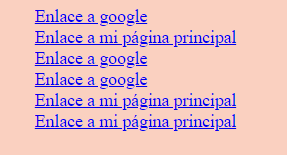
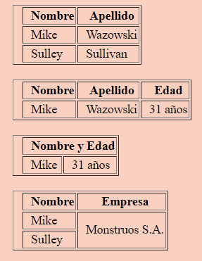

# 2. Referencias(enlaces), tablas y contenido multimedia

## Enlaces
***
Los enlaces son vínculos con otros documentos, webs, imágenes... Al hacer click sobre ellos nos lleva a la ruta de destino que le hemos especificado y al pasar el ratón sobre ellos, el cursor cambia.

La etiqueta que utilizamos para los enlaces es la \<a> \</a>, la cual tiene un atributo obligatorio de nombre valor _href_: \<a href="">\</a>. En el valor debemos especificar la ruta a la que deseamos viajar.
Dentro de cada etiqueta de enlace, debemos especificar el texto que queremos darle a este link, el cual será visible en el navegador.

Por otro lado, un atributo opcional que podemos poner dentro de la etiqueta es el atributo _target_, que define la parte del navegador donde se abrirá este enlace (si en una nueva pestaña, en la misma, en una ventana...). En el caso de que no pusiéramos este atributo, por defecto abrirá el documento en la misma ventana.

Los valores que puede tener la etiqueta target son:

- **\_self**:este es su comportamiento por defecto. Al pulsar click, el documento se abrirá en esta misma ventana.

- **\_blank**: al pulsar en el enlace, este se abrirá en una nueva pestaña.

- **\_parent**: cuando pinchamos en este enlace, este link se añadiría a nuestra url. Suele ser útil cuando queremos navegar dentro de nuestra web.

- **\_top**: abre el documento dentro de la propia ventana.

#### ¿Cómo escribirlo en código?

```html
    - Enlace a una url: <a href="www.google.es">Enlace a google</a>

    - Enlace a una ruta de nuestra carpeta: <a href="./index.html">Enlace a mi página principal</a>

    - Enlace a una ruta con el atributo target y valor _self: <a href="www.google.es" target="_self">Enlace a google</a>

    - Enlace a una ruta con el atributo target y valor _blank: <a href="www.google.es" target="_blank">Enlace a google</a>

    - Enlace a una ruta con el atributo target y valor _parent: <a href="./index.html" target="_parent">Enlace a mi página principal</a>

    - Enlace a una ruta con el atributo target y valor _top: <a href="./index.html" target="\_top">Enlace a mi página principal</a>
```

#### ¿Cómo se vería representado?



#### Recursos

[Enlaces | w3schools](https://www.w3schools.com/html/html_links.asp)

## Tablas
***
Otra de las etiquetas que nos ofrece HTML nos permite crear tablas. Dado que las tablas están formadas por filas y columnas, estas también habrá que especificarlas dentro de la etiqueta. La composición de las etiquetas presenta un ejemplo parecido al de las listas.

La etiqueta para representar una tabla es \<table>\</table>. Dentro de esta etiqueta irán las filas \<tr>\<tr>, y por cada fila habrá un número de columnas determinado \<th>\<th>, utilizándose estas etiquetas como los títulos de las columnas, por lo que esta etiqueta solo se pondría en la primera fila. Después, dentro de cada fila \<tr>\</tr>, con la etiqueta \<td>\</td> escribiremos tantas etiquetas como columnas haya.

Por otro lado, para las tablas contamos con dos atributos que nos permiten darles propiedades distintas a las columnas o las tablas. Estos dos atributos se expresan en nombre valor, siendo el valor un número. Tenemos el atributo _colspan_, el cual se expandirá creando una columna que ocupará el espacio de celdas del número que le indiquemos y el atributo _rowspan_, que expandirá la fila según el número que le indiquemos.

#### ¿Cómo escribirlo en código?

```html
    <table border="1">
      <tr>
        <th>Nombre</th>
        <th>Apellido</th>
      </tr>
      <tr>
        <td>Mike</td>
        <td>Wazowski</td>
      </tr>
      <tr>
        <td>Sulley</td>
        <td>Sullivan</td>
      </tr>
    </table>


    <table border="1">
      <tr>
        <th>Nombre</th>
        <th>Apellido</th>
        <th>Edad</th>
      </tr>
      <tr>
        <td>Mike</td>
        <td>Wazowski</td>
        <td>31 años</td>
      </tr>
    </table>

    <table border="1">
      <tr>
        <th colspan="2">Nombre y Edad</th>
      </tr>
      <tr>
        <td>Mike</td>
        <td>31 años</td>
      </tr>
    </table>

  
    <table border="1">
      <tr>
        <th>Nombre</th>
        <th>Empresa</th>
      </tr>
      <tr>
        <td>Mike</td>
        <td rowSpan="2">Monstruos S.A.</td>
      </tr>
      <tr>
        <td>Sulley</td>
      </tr>
    </table>
```

#### ¿Cómo se vería representado?




#### Recursos

[Tablas | w3schools](https://www.w3schools.com/html/html_tables.asp)


## Imágenes
***
En HTML5 también podemos insertar imágenes. Estas imágenes pueden provenir de la carpeta de nuestro proyecto o de un recurso externo. La etiqueta que se utiliza es la de \\</img> la cual tiene un atributo obligatorio que determina la ruta de donde debe coger la imagen. Este atributo es _src_ y su valor es la ruta. Aparte de este atributo, suele llevar otro, que no es obligatorio, pero es altamente recomendable. Provee de un texto alternativo a la imagen, en el caso de que el navegador no la carge. Ese atributo es _alt_ y su valor debe ser descriptivo de la imagen que vamos a presentar en nuestro navegador.

Las extensiones que suele aceptar el atributo src son _.jpeg_, _.jpg_, _.svg_, _.png_, _.gif_

#### ¿Cómo escribirlo en código?

```html
    - Imagen de nuestro proyecto: 
    

    - Imagen de un recurso externo:
    

    - Gif de un recurso externo:
    
```


#### ¿Cómo se vería representado?


#### Recursos

[Imágenes | w3schools](https://www.w3schools.com/html/html_images.asp)

## Videos
***
En nuestra página también podemos poner todos los videos que queramos. La etiqueta \<video>\</video> lleva consigo una serie de elementos en su construcción que a continuación comentaremos:

```html
    <video width="320" height="240" controls>
      <source src="movie.mp4" type="video/mp4">
      <source src="movie.ogg" type="video/ogg">
    Your browser does not support the video tag.
    </video>
```

Como ves, en la etiqueta video usamos los atributos _width_, _height_ y _controls_. Los dos primeros sirven para indicarle el ancho (que viene por defecto en píxeles) y el alto. El atributo controls le da los controles de play, pausa y volumen. Por otro lado, dentro de la etiqueta video le debemos indicar la fuente, con la etiqueta \<source> que llevará los atributos _src_ para indicar la ruta y el tipo de extensión que trae.

De nuevo, podemos utilizar tanto los videos que haya en nuestra carpeta de proyecto, como un recurso externo.

#### ¿Cómo escribirlo en código?

```html
    <video width="320" height="240" controls>
      <source src="movie.mp4" type="video/mp4">
      <source src="movie.ogg" type="video/ogg">
    Your browser does not support the video tag.
    </video>
```

#### ¿Cómo se vería representado?

<video width="320" height="240" controls>
  <source src="movie.mp4" type="video/mp4">
  <source src="movie.ogg" type="video/ogg">
Your browser does not support the video tag.
</video>

#### Recursos

[Videos | w3schools](https://www.w3schools.com/html/html5_video.asp)

## Audios
***
También podemos insertar audios dentro de nuestra web. Esta etiqueta lleva una estructura semejante a la etiqueta de video que hemos visto, por lo que según qué queramos mostrar, si un audio o video, lo único que cambiará será la etiqueta en vez de \<video>\</video>, sería \<audio> y la extensión (en vez de _.mp4_, _.mp3_).

#### ¿Cómo escribirlo en código?

```html
    <audio controls>
      <source src="horse.ogg" type="audio/ogg">
      <source src="horse.mp3" type="audio/mpeg">
    Your browser does not support the audio element.
    </audio>
```

#### ¿Cómo se vería representado?

<audio controls>
  <source src="horse.ogg" type="audio/ogg">
  <source src="horse.mp3" type="audio/mpeg">
Your browser does not support the audio element.
</audio>

#### Recursos

[Audios | w3schools](https://www.w3schools.com/html/html5_audio.asp)

## Rutas absolutas y relativas
***
En el momento en el que queremos utilizar una imagen, un video, un audio, o incluso un archivo que hay dentro de nuestro proyecto, cogemos su ruta. A pesar de que puede tratarse de una web o de un archivo que se encuentre dentro de nuestra carpeta, el concepto es el mismo como veremos a continuación. Existen dos tipos de rutas:

- **Rutas absolutas:** en el caso de que sea una web, la ruta será el dominio completo, incluyendo la url y el tipo de enlace (http). En el caso de elementos dentro de nuestro proyecto, la ruta se escribe siguiendo el orden de directorios desde el disco duro hasta llegar al archivo que queremos utilizar. Dado que la ruta puede cambiar, ya que podemos cambiar de ordenador o incluso cambiar la carpeta del proyecto a otro lugar, las rutas absolutas en los proyectos son desaconsejables. La forma en que es expresa una ruta absoluta en una web sería así: _htttp://www.ejemplo.com/img/jpg/imagen.jpg_ y si fuera la de nuestro proyecto _C:\carpeta1\carpeta2\carpeta3\carpeta4\archivo1.html_

- **Rutas relativas:** especifica la ruta de un archivo respecto a su posición actual. Son aconsejables ya que si la carpeta del proyecto se mueve, las rutas se siguen manteniendo. En el caso de que se trate de un archivo que esté en la misma carpeta, la forma de escribir la ruta sería _'./clase1.html_. Si estuviera en un nivel anterior, utilizaríamos dos puntos en vez de uno, para subir de directorio: _../clase1.html_ y así consecutivamente. Es muy aconsejable utilizar este tipo de ruta, ya que salvo que los archivos cambien de ruta dentro de la carpeta de nuestro proyecto, las rutas se mantendrán igual, ya que funcionarán.

#### ¿Cómo escribirlo en código?

```html
- **Ruta absoluta de un link**: https://www.w3schools.com/html/html_links.asp
- **Ruta relativa de un archivo de una carpeta de nuestro proyecto**: C:\Users\thebridge\Desktop\proyectos\semanaHTML\primer-dia\clase1.html
- **Ruta relativa de un link**: './html/html_links.asp
- **Ruta relativa de un archivo de una carpeta de nuestro proyecto que está en la misma carpeta**: './clase2.html'
- **Ruta relativa de un archivo de una carpeta de nuestro proyecto que está en una carpeta por encima**: '../clase2.html'
- **Ruta relativa de un archivo de una carpeta de nuestro proyecto que está dos carpetas por encima**: '../../clase2.html'
- **Ruta relativa de un archivo de una carpeta de nuestro proyecto que está dos carpetas por encima y dos más abajo**: '../../primer-dia/clase2.html'
```

#### ¿Cómo se vería representado?

Las rutas relativas solo se verán en el código, ya que es el nombre que le damos a ese link será el que aparezca representado. 

#### Recursos

[Rutas absolutas y rutas relativas | PressRoom](https://pressroom.hostalia.com/white-papers/rutas-absolutas-y-relativas/)

---

