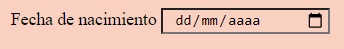
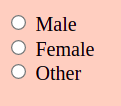

# 3. Etiquetas semánticas y formularios

## Etiquetas semánticas
***
Las etiquetas semánticas se utilizan para darle una estructura a nuestro documento de HTML. Darle una estructura más sólida permite que sea más fácil identificar las partes de la página, por lo que será más accesible y más fácil de manipular. Las etiquetas semánticas tienen la capacidad de describir el contenido de las etiquetas que hay dentro de ellas, frente a las no semánticas, que no definen el tipo de contenido que hay dentro (como la etiqueta <div> o la etiqueta <span>).

Las etiquetas semánticas más comunes son las siguientes:

- **\<header>\</header>**: define la cabecera de la página. En ella suelen ir el título principal, el logo e información del autor.

- **\<nav>\</nav>**: define la barra de navegación. Dentro de esta etiqueta van una serie de links que nos llevan a las distintas partes de la página o incluso a recursos externos. Suele estar dentro de la cabecera.

- **\<main>\</main>**: define el contenido principal de un documento. En el se engloba la mayor parte de la estructura del documento.

- **\<footer>\</footer>**: define el pie de un documento. En él suele ir la información de contacto o los servicios que ofrece.

- **\<aside>\</aside>**: define un contenido que está dentro del main y suele estar posicionado en una barra lateral. Da información adicional acerca de lo que hay dentro del main.

- **\<section>\</section>**: define una sección dentro del main.

- **\<article>\</article>**: define un artículo dentro del main.

¿Articulos dentro de cada sección o secciones dentro de cada artículo? Existe mucha controversia acerca de este tema, ya que existen distintos puntos de vista acerca de qué sería lo más correcto. Dependiendo la forma en que nosotros entendamos cómo se estructura la página, pondremos varias etiquetas \<section> con \<article> dentro, o varias etiquetas \<article> con etiquetas de \<section> dentro de ellas.

#### ¿Cómo escribirlo en código?


 - \<header>\</header>: 
  ```html
        <header>
          <h1>El título de mi página</h1>
          </img>
  ```
-  \<main>\</main>: 
  ```html
        <main>
          <section>
            <article>
              <p>Primer párrafo</p>
              <p>Segundo Párrafo</p>
            </article>
            <article>
              <p>Primer párrafo</p>
              <p>Segundo Párrafo</p>  
            </article>
          </section>
        </main>
  ```

- \<footer>\</footer>: 
  ```html
        <footer>
          <p>Mi nombre</p>
          <ul>
            <li>Servicio 1 que ofrezco</li> 
            <li>Servicio 2 que ofrezco</li> 
            <li>Servicio 3 que ofrezco</li>
          <ul>
        </footer>
  ```

- \<aside>\</aside>: 
    ```html
    <aside>
        </img>
        <p>Texto adicional</p>
      </aside>
    ```

- \<section>\</section>: 
   ```html
   <section>
        <h2>Primera sección<h2>
        <p>Texto de la primera sección</p>  
      </section> 
      <section>
        <h2>Segunda sección<h2>
        <p>Texto de la primera sección</p>
      </section>
    ```

- \<article>\</article>: 
     ```html 
      <article>
        <h2>Primer artículo<h2>
        <p>Texto del primer artículo</p>
      </article>
      <article>
        <h2>Segundo artículo<h2>
        <p>Texto del segundo artículo</p>
      </article>
  ```

#### ¿Cómo se vería representado?

Al ser etiquetas semánticas no se verán representadas en el código, solo nos sirven a nosotros para agrupar en nuestro html y sea más accesible. 

#### Recursos

- [Etiquetas semánticas](https://www.w3schools.com/html/html5_semantic_elements.asp)


## Formularios
***
Los formularios son muy útiles para recoger información que necesitamos del usuario. La etiqueta que se utiliza es la de \<form>\</form> y dentro de esta etiqueta hay diferentes entradas o lo que llamamos inputs, que recogen distinta información según el tipo que sea y se representan con la etiqueta \<input>\</input>. En ocasiones, estos inputs llevan asociados unos títulos, representados con la etiqueta \<label>\</label> que sirven para describir la información que debe rellenar el usuario. Por último, también llevan asociados un botón que enviará la información, cuya etiqueta es \<button>\</button>.

### Etiqueta form y sus atributos
***
La etiqueta form siempre presenta tres atributos con un valor asociado:

- **Atributo _action_**: define la acción y el archivo a donde va a ser enviada la información.
- **Atributo _target_**: este atributo define el lugar donde va a aparecer la respuesta de que se ha enviado la información. Esta atributo es el mismo que utilizamos con los links, por lo que sus posibles valores serán o _\_blank_ o _\_self_ o _\_parent_ o _\_top_ o _\_framename_. Por defecto, su valor será _\_blank_
- **Atributo _method_**: especifica el método HTTP con el que se enviará la información. El valor de este atributo puede ser _get_, que es su comportamiento por defecto y envía la información a través de la url o el método _post_ que envía la información en el cuerpo de la petición, por lo que la información no aparece en la url.
- **Atributo _autocomplete_** (opcional): al poner este atributo dentro de la etiqueta form, le indicamos al navegador que puede autocompletar la información con valores que hayamos utilizado en el pasado (como por ejemplo, cuando nos sugiere el email que ya hemos utilizado en otras páginas). Sus valores pueden ser _on_, en el caso de que queramos que lo autocomplete y _off_ si no queremos.

El atributo action es obligatorio, sin embargo, si no utilizamos los atributos de target, method y autocomplete, se seguirán aplicando, ya que utilizarán sus valores por defecto. A continuación veremos unos ejemplos en los que si no aparecen estos atributos, tendrán su comportamiento por defecto. Podemos combinar estos atributos como necesitemos, ya que al tener cada uno su función, no son excluyentes.

#### ¿Cómo escribirlo en código?

```html
      <form action="/data"></form>. Aquí se enviará la información a la carpeta data, con la target \_blank, método get y autocomplete off.

      <form action="/data" target="_self"></form>. Aquí se enviará la información a la carpeta data, con la target \_self, método get y autocomplete off.
      
      <form action="/data" target="_parent" method="post"></form>. Aquí se enviará la información a la carpeta data, con la target \_self, método get y autocomplete off.
      
      <form action="/data" target="_top" method="post"></form>. Aquí se enviará la información a la carpeta data, con la target \_self, método get y autocomplete off.
```

#### ¿Cómo se vería representado?

Todos los formularios se ven representados de la misma forma, por lo que no influye el método de envío de información a la hora de verse representado.

### Etiqueta label y su atributo for
***
La etiqueta label se utiliza para dar un título o breve descripción a los inputs. Esto es de utilidad porque se asocia a un input dándole un significado. Además ayuda cuando nos encontramos con inputs que hay que seleccionar, ya que seleccionando su label, el input queda señalado. Lleva asociado siempre un atributo obligatorio.

- **Atributo _for_**: el valor de este atributo es una palabra que describe el elemento al que va asociado, por ejemplo, un nombre, la edad, el género... El atributo for debe ser siempre el mismo que el atributo id del input al que acompaña, para así asociarlos.

#### ¿Cómo escribirlo en código?
```html
    <label for="name">Nombre</label>
    <label for="client_name">Tu nombre</label>  
    <label for="client_age">Tu edad</label>
```

#### ¿Cómo se vería representado?


### Etiqueta input y sus muchos tipos
***
La etiqueta input se utiliza para recibir información sobre el usuario. Al usar esta etiqueta, según el tipo de input que hayamos indicado, su representación será distinta, aunque la mayor parte de etiquetas aparecerán representadas con un rectángulo en el que el usuario debe escribir.

Los atributos que lleva asociados la etiqueta input son varios, y sus valores pueden ser muy diferentes. La construcción de una etiqueta input es la siguiente: *\<input type="el tipo de input que queremos poner" id="el texto que hemos puesto en el atributo for del label, para asociarlo" name="el nombre del elemento que se está enviando" value="en el caso de que queremos darle un valor por defecto">*. A continuación estudiaremos estos atributos y todos sus posibles valores:

### Atributo type del input
***
El valor del atributo type del input al que lo asociamos depende de los tipos de datos que estemos recogiendo en él. Podemos recoger muchos tipos de datos, como veremos a continuación. 

La razón de utilizar distintos tipos de inputs reside es que en muchas ocasiones, los inputs limitan el tipo de dato que queremos poner: por ejemplo, si ponemos un input de tipo _number_, solo nos dejará escribir números en el input, o si ponemos un input de tipo _password_, la contraseña que esa persona escribe no se mostrará en el ordenador. Esta etiqueta solo es de apertura, ya que no lleva dentro ningún texto escrito. 

Es muy importante saber que tipo de input se adecua a nuestras necesidades, por lo que a continuación, veremos los tipos de inputs más utilizados. Para estudiarlos mejor, vamos a agruparlos según lo que se vería representado, utilizando en los ejemplos una etiqueta label:

*1. Un campo a rellenar:*

- **type="text"**: se utiliza este tipo de input cuando queremos recoger una línea de texto. Se utiliza por ejemplo para nombres, apellidos, frases cortas... 

#### ¿Cómo escribirlo en código?
```html
    <label for=id="user_name">Nombre</label>
    <input type="text" id="user_name" name="name">
```

#### ¿Cómo se vería representado?


- **type="number"**: este input solo recoge valores numéricos. Se utiliza por ejemplo para la edad, número de hijos, números concretos...

#### ¿Cómo escribirlo en código?
```html
    <label for=id="user_age">Edad</label>
    <input type="number" id="user_age" name="age">
```


#### ¿Cómo se vería representado?


- **type="password"**: recoge un campo que es una contraseña. El texto que se escribe en este input, es sustituido con unos asteriscos, ya que es información sensible. \<input type="number" id="password" name="password">

#### ¿Cómo escribirlo en código?
```html
    <label for=id="password">Contraseña</label>
    <input type="number" id="password" name="password">
```


#### ¿Cómo se vería representado?


- **type="email"**: en este input solo se podrá escribir texto que contenga un email, es decir, que debe tener contener una @ y la extensión. \<input type="email" id="email" name="email">

#### ¿Cómo escribirlo en código?
```html
    <label for=id="email">Email</label>
    <input type="email" id="email" name="email">
```

#### ¿Cómo se vería representado?


- **type="date">**: este input nos permite elegir una fecha concreta, por lo que el input que aparece es una pequeña imagen de un calendario que al pulsarlo se muestra un desplegable de calendario que nos permite seleccionar una fecha la cual aparecerá en ese input al seleccionarla. 

#### ¿Cómo escribirlo en código?
```html
    <label for=id="birthday">Fecha de nacimiento</label>
    <input type="date" id="birthday" name="birthday">
```

#### ¿Cómo se vería representado?



- **type="month">**: es muy parecido al input de tipo date, ya que nos permite seleccionar en un calendario. Sin embargo, solo podemos seleccionar un mes en concreto y un año. 

#### ¿Cómo escribirlo en código?
```html
    <label for=id="mymonth">Mes de nacimiento</label>
    <input type="month" id="mymonth" name="month">
```

#### ¿Cómo se vería representado?


*2. Un botón:*

- **type="submit"**: es el tipo de input más importante y obligatorio, ya que se verá representado con un botón que tiene la función de que al pulsar sobre él envía los datos del formulario que han sido recogidos dentro de los inputs. Esta información será enviada a donde se haya definido en el _atributo action del form_ y no lleva asociado con él ni el atributo id, ni el atributo name, ya que este input no aporta información, solo la envía. 

#### ¿Cómo escribirlo en código?
```html
    <input type="submit" value="Enviar">
```

#### ¿Cómo se vería representado?


- **type="reset"**: este input se verá representado con un botón y al pulsarlo, hará que toda la información que haya rellenado el usuario vuelva a sus valores iniciales, que suelen ser los inputs vacíos. Al igual que el input type submit, este no aporta ninguna información al enviar el formulario, e incluso tampoco tiene valor, por lo que la etiqueta se escribiría: 

#### ¿Cómo escribirlo en código?
```html
    <input type="reset">
```

#### ¿Cómo se vería representado?


- **type="checkbox"**: con este input podremos visualizar en el navegador un cuadrado vacío que podremos pulsar o no, según la información que viene en el label. Este tipo de input suele llevar asociado en muchas ocasiones otro atributo _required_, que veremos más adelante e indica que es campo requerido (es decir, que debe estar pulsando al enviarse la información pulsando el botón submit). Para darle una descripción a este input, por cada checkbox que hay, habrá un label. 

#### ¿Cómo escribirlo en código?
```html
    <input type="checkbox" id="conditions" name="condiciones" required> 
    <label for="conditions">He leído y acepto las condiciones</label>
```

#### ¿Cómo se vería representado?


- **type="radio"**: se utiliza cuando queremos que el usuario elija una de las opciones que le presentamos. Por defecto, el input se verá representado con un círculo y el texto que llevará consigo será el del label (texto necesario para que el usuario conozca las diferentes opciones). Para que solo se pueda seleccionar una opción, el valor del atributo name debe ser el mismo, para que nos llegue solo la opción seleccionada bajo ese nombre.

#### ¿Cómo escribirlo en código?
```html
        <input type="radio" id="female" name="gender" value="mujer">
        <label for="male">Male</label><br>
        <input type="radio" id="male" name="gender" value="hombre">
        <label for="female">Female</label><br>
        <input type="radio" id="other" name="gender" value="otro">
        <label for="other">Other</label>
```

#### ¿Cómo se vería representado?



  - **type="file"**: podemos utilizar este tipo de input cuando queremos adjuntar un archivo, por lo que se vería representado con un botón al que pulsar, el cual nos permitiría buscar en nuestro directorio el archivo a adjuntar. 

#### ¿Cómo escribirlo en código?
```html
        <input type="file" id="myfile" name="myfile">
```

#### ¿Cómo se vería representado?


  -**type="image"**: este input nos permite adjuntar una imagen, es decir un archivo que contengan la extensión de una imagen (.jpeg, .jpg, .svg...), para utilizarla como botón de enviar, por ello, su alt será _Submit_. 

  ### ¿Cómo escribirlo en código?
```html
    <input type="image" src="./images/icon.png" alt="Submit" width="48" height="48">
```

#### ¿Cómo se vería representado?


  -**type="color"**: este tipo de input nos permite escoger un color, por ello, el input se presenta como un botón que al pulsarlo hará que aparezca un cuadro que es el selector de color.


#### ¿Cómo escribirlo en código?
```html
    <input type="color" id="mycolor" name="color" value="#ff0000">
```

##### ¿Cómo se vería representado?


### Atributos adicionales del input
***

- **readonly**: este atributo se utiliza cuando queremos poner un input con un valor por defecto, que no se puede cambiar, solo puede leerse. 

#### ¿Cómo escribirlo en código?
```html
    <input type="text" id="name" name="name" value="Luis" readonly>
```

- **disabled**: lo utilizaremos en el caso de que no queramos que ese input se utilice. No se puede clicar sobre él ni interactuar. Se puede utilizar por ejemplo, cuando traemos información de la base de datos, a ese input, que no queremos que sea modificada. 

#### ¿Cómo escribirlo en código?
```html
    <input type="text" id="name" name="name" value="Luis" disabled>
```

- **size**: lo podemos utilizar cuando queramos cambiar el ancho del input. Su tamaño por defecto es 20, pero podemos ponerle el valor que deseemos. 

#### ¿Cómo escribirlo en código?
```html
    <input type="text" id="name" name="name" size="70">
```

- **maxlength**: dicho atributo se utiliza cuando queremos que en el input puedan ponerse un máximo de caracteres. 

#### ¿Cómo escribirlo en código?
```html
    <input type="text" id="pin" name="pin" maxlength="4">
```

- **maxlength**: dicho atributo se utiliza cuando queremos que en el input puedan ponerse un mínimo de caracteres. 

#### ¿Cómo escribirlo en código?
```html
    <input type="text" id="pin" name="pin" maxlength="1">
```

- **min and max**: se utilizan cuando queremos especificar un mínimo y un máximo de un valor, por lo que sólo se puede utilizar con inputs de tipo número, fecha, mes, tiempo...

#### ¿Cómo escribirlo en código?
```html
      <input type="date" id="datemax" name="datemax" min="2002-01-01 "max="1950-01-01">
``` 

- **multiple**: cuando el usuario puede utilizar varios archivos o poner varios email (se utiliza con esos tipos de input). 

#### ¿Cómo escribirlo en código?
```html
      <input type="file" id="files" name="files" multiple>
```

- **placeholder**: se utiliza cuando queremos dar una breve descripción dentro de el input, que aparecerá en él de forma tenue, ya que se utiliza para guiar al usuario sobre qué tiene que poner dentro de él. 

#### ¿Cómo escribirlo en código?
```html
      <input type="text" id="name" name="name" placeholder="Tu nombre">
```

- **required**: significa que es obligatorio rellenar ese input, ya que si se intenta enviar la información, no nos lo permitirá hasta que ese campo esté rellenado. 

- **autofocus**: este atributo lo utilizaremos para señalar el input donde tiene que empezar el cursor al cargar la página. 

#### ¿Cómo escribirlo en código?
```html
    <input type="text" id="name" name="name" autofocus>
```

- **height y width**: sirven para especificar el ancho (width) y el alto (heigth) del input. 

#### ¿Cómo escribirlo en código?
```html
    <input type="text" id="name" name="name" width="80" heigth="40">
```

### Etiqueta select
***
Esta etiqueta se utiliza a la hora de incluir un desplegable con una lista dentro de él. En este caso pondríamos un label y la etiqueta \<select id="el texto que hemos puesto en el atributo for del label, para asociarlo" name="el nombre del elemento que se está enviando">\</select>. 

Dentro de la etiqueta select, pondremos todas las opciones, las cuales se indican con la etiqueta \<option value="el valor que le das a esa opción y que se enviará">. Por defecto, si no se selecciona ninguna opción, se enviará la primera, por lo que si queremos que en el desplegable del input aparezca seleccionada otra opción en vez de la que hay por defecto, utilizaremos el atributo _selected_, al cual no hay que ponerle ningún valor. Por otro lado, podemos poner dentro de la etiqueta select, el atributo _size_, cuyo valor, que debe ser un número, indicará el número de opciones que se verán por defecto sin abrir el desplegable. También podemos poner el atributo _multiple_ que no lleva ningún valor, para que el usuario pueda seleccionar varias opciones.

#### ¿Cómo escribirlo en código?

```html
    <label for="color">Elige tu color favorito:</label>
    <select id="color" name="color" size="2" multiple>

    <option value="pink">Rosa</option>
    <option value="blue">Azul</option>
    <option value="black">Negro</option>
    <option value="white">Blanco</option>
    </select>
```

#### ¿Cómo se vería representado?


### Etiqueta texarea
***

Esta etiqueta es como la etiqueta de \<input type="text">, con la diferencia de que en ella se pueden escribir muchas más lineas, según el número que le indiquemos. La construcción de la etiqueta sería la siguiente \<texarea name="message" rows="10" cols="30"></texarea>, donde el atributo _name_ es la descripción de lo que se escribirá en el input, _rows_ es el número de líneas que se pueden escribir y _cols_ indica el ancho del input en el que se escribirá.

#### ¿Cómo escribirlo en código?

```html
    <textarea name="your-opinion" rows="8" cols="20"></textarea>
```

#### ¿Cómo se vería representado?


### Etiqueta datalist
***
La etiqueta datalist se utiliza cuando queremos poner unas opciones predefinidas, que pueden ayudar al usuario a seleccionar una de ellas, pero que no implica que deba ser una de ellas. Su comportamiento sería como el de un buscador, el cual nos sugiere opciones según lo que estemos escribiendo. Acompaña a un input, en el cual se puede escribir. La etiqueta datalist contiene dentro una serie de opciones y acompaña a un input donde el usuario puede escribir.

#### ¿Cómo escribirlo en código?

```html
    <form action="/action_page.php">
      <input list="browsers" name="browser">
      <datalist id="browsers">
        <option value="Internet Explorer">
        <option value="Firefox">
        <option value="Chrome">
        <option value="Opera">
        <option value="Safari">
      </datalist>
      <input type="submit">
    </form>
```

#### ¿Cómo se vería representado?


#### Etiqueta button
***
Se utiliza cuando queremos poner un botón en el que se pueda clicar. Es una alternativa al botón de enviar, por ello, según el comportamiento que le asociemos en su atributo onclick, hará una acción u otra.

#### ¿Cómo escribirlo en código?

```html
<button type="button" onclick="alert('Hello World!')">Click Me!</button>
```

#### ¿Cómo se vería representado?


#### Recursos

- [Formularios básicos](https://www.w3schools.com/html/html_forms.asp)
- [Elementos de formulario](https://www.w3schools.com/html/html_form_elements.asp)
- [Atributos de formulario](https://www.w3schools.com/html/html_forms_attributes.asp)
- [Tipos de inputs de formulario](https://www.w3schools.com/html/html_form_input_types.asp)
- [Atributos de inputs](https://www.w3schools.com/html/html_form_attributes.asp)

---

