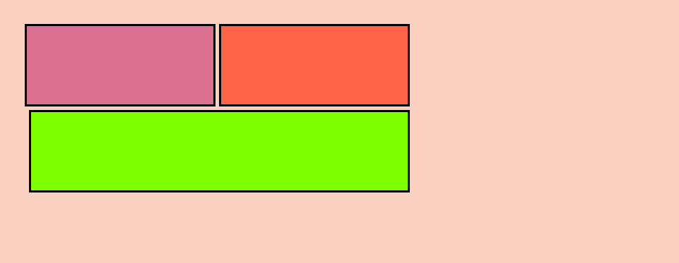

# 4. Display y flexbox

## Display
***
La propiedad display en CSS controla la forma en que se muestran los elementos. Cada elemento, por su propia naturaleza, tiene un tipo de visualización por defecto, que suele ser en *bloque o en línea*. Con la propiedad display, nosotros podemos cambiar su valor por defecto, es decir, podemos hacer un elemento de bloque, de línea y un elemento de línea de bloque.

Además de estos dos valores que tienen por defecto, existen más formas de visualización, como por ejemplo *display: none*, que oculta el elemento sin borrarlo (se utiliza por ejemplo, si queremos ocultar en una lista los iconos que aparecen a su izquierda). Esta propiedad tiene un comportamiento diferente a *visibility: hidden*, ya que display:none, se oculta y por lo tanto el espacio que ocupaba, ya no lo ocupa. Sin embargo, con visibility:hidden, aunque el elemento esté 'escondido', sigue ocupando el espacio que ocupa, aunque el elemento no se vea. 
 

#### ¿Cómo escribirlo en código?

```css
elemento en línea: a {
    display: inline
}

elemento en línea que cambiamos a bloque: a {
    display: block
}

elemento en bloque: div {
    display: block
}

elemento en bloque que cambiamos a línea: div {
    display: inline
} 

display: none: img {
    display: none
}

display:none vs visibility: hidden:
img {
    display: none
}

img {
    visibility: hidden
}
```

#### Recursos

- [Display](https://www.w3schools.com/css/css_display_visibility.asp)


## Flexbox
***
Flexbox es una nueva propiedad de display, que nos permitirá jugar con los distintos contenedores, para poder posicionarlos de la forma que necesitemos. 

Aplicando la propiedad flex a display, podremos utilizar todas las propiedades que nos brinda, para manejar los distintos contenedores. Debemos saber que estas propiedades no son obligatorias, solo utilizaremos aquellas que necesitemos para darle el efecto deseado. Existen aquellas que se aplican a los padres y aquellas que se aplican a los hijos, como veremos a continuación. 

### Propiedades que se aplican a los padres:

**FLEX-DIRECTION**: 
Determina la dirección en la que se posicionan los contenedores que hay dentro del bloque al que le aplicamos esta propiedad. Sus valores pueden ser: 

- **row**: que es la propiedad por defecto. Los contenedores crecen de forma horizontal de izquierda a derecha.

- **row-reverse**: a diferencia del anterior, aunque los contenedores se posicionan de forma horizontal, lo harán de derecha a izquierda. 

- **column**: los contenedores crecen de forma vertical, de arriba a abajo. 

- **column-reverse**: crecerán de forma vertical, pero de abajo a arriba. 


**FLEX-WRAP**:
Con esta propiedad, podemos hacer que los contenedores que hay dentro del bloque que los contiene, en el caso de no ocupar el espacio que le hemos indicado con el ancho dentro de él, puedan posicionarse en la siguiente línea. 

- **nowrap**: es su comportamiento por defecto. Todos los elementos estarán en una línea. 

- **wrap**: si le damos este valor, le daremos la posibilidad de posicionarse en las siguientes líneas, según sea necesario. 

- **wrap-reverse**: al igual que con wrap, le damos esta posibilidad, pero en vez de crecer para la siguiente línea, crecerá para la línea anterior. 


**FLEX-FLOW**: 
Esta propiedad es la conjunción entre flex-direction y flex-wrap. Sus posibles valores serán: 

- **row nowrap**: este es su comportamiento por defecto. 

- **row wrap**

- **row wrap-reverse**

- **column nowrap**

- **column wrap**

-**column wrap-reverse**


**JUSTIFY-CONTENT**: 
Determina la forma en que se esparcen a lo largo de la fila o la columna los contenedores del bloque que los contiene. Sus valores pueden ser: 

- **flex-start**: este es su comportamiento por defecto. Los contenedores se posicionan juntos al principio de la línea (con flex direction le habremos indicado si es una fila o una columna)

- **flex-end**: los elementos se posicionan juntos al final de la línea. 

- **start**: los elementos se agrupan hacia el principio de la dirección en la que se está escribiendo. 

- **end**: los elementos se agrupan hacia al final de la dirección en la que se está escribiendo. 

- **left**: los elementos se posicionan en el borde izquierdo (en el caso de que flex-direction sea column), si no, se situarán a la izquierda, como si tuvieran la dirección de flex-direction:start.

- **right**: los elementos se posicionan en el borde derecho (en el caso de que flex-direction sea column), si no, se situarán a la derecha, como si tuvieran la dirección de flex-direction:end.

- **center**: los items se posicionan juntos en el centro de la línea.

- **space-between**: los elementos se esparcirán a lo largo de toda la línea, ocupando el primer y el último elemento, el principio y el final de la línea, ocupando los demás elementos que se encuentran entre ellos la misma distancia entre todos. 

- **space-around**: los elementos se esparcen a lo largo de la línea. El comportamiento es parecido al anterior, sin embargo, la distancia no es la misma entre todos, ya que el elemento del principio y del final presentan un margen por la izquierda y por la derecha, que hace que estén algo separados del principio de la línea y del final, por lo que esa es la razón por la que las distancias entre los elementos se mantiene entre los elementos que hay en medio de estos dos, pero no es la misma, que la que presentan el elemento inicial y final.

- **space-evenly**: la diferencia que guarda con space-around es que sí que se guarda la misma distancia entre todos los elementos (incluyendo los márgenes que presenta a la izquierda el primer elemento y a la derecha el último). 


**ALIGN-ITEMS**: 
Esta propiedad determina donde se posicionarán los elementos del contenedor, respecto a su eje transversal (la línea que estaría en el centro de los elementos). Sus valores son:

- **stretch**: este es su comportamiento por defecto. Los elementos se esparecen por todo el contenedor, tanto por encima como por debajo del eje transversal, por lo que ocupan todo el espacio. 

- **flex-start**: los elementos se posicionan por encima del eje transversal. 

- **flex-end**: los elementos se posicionan por debajo del eje transversal.

- **center**: los elementos crecen a partir del eje transversal, ocupando el espacio que le hayamos indicado. 

- **baseline**: los elementos se alinean a partir del eje transversal, y del la línea de abajo de su texto. Estas dos variables toman el mismo lugar y los elementos crecen a partir de ahí. 


**ALIGN-CONTENT**:
Esta propiedad define donde se posicionarán los elementos y la distancia que habrá entre ellos. La diferencia con align-items es que align-items determina como deben alinearse los elementos dentro del bloque, mientras que align-content tendremos en cuenta el eje transversal, ya que trabaja también con elementos que ocupan más de una línea. Los elementos se posicionan según la posición del eje transversal del bloque que los contiene. 

- **normal**: los ítems toman su posición por defecto.

- **flex-start**: los elementos se agrupan todos al principio del bloque, tomando como referencia el eje transversal. 

- **flex-end**: los elementos se agrupan todos al final del bloque, tomando como referencia el eje transversal. 

- **center**: los elementos se agrupan todos en el centro del bloque, tomando como referencia el eje transversal. 

- **space-between**: los elementos se esparcen por todo el bloque, siendo la primera línea la que está al principio del bloque y la última, al final del bloque, sin apenas márgenes, y manteniendo la misma distancia entre todas las filas. 

- **space-around**: los elementos se esparcen por todo el bloque, aunque la distancia es la misma entre las líneas del medio, la distancia que hay entre la primera línea con el borde del contenedor que las contiene, y el del final, es distinta. 

- **space-evenly**: esta propiedad es parecida a la anterior, solo que existe la misma distancia entre todas las filas. 

- **stretch**: intentarán ocupar el mayor espacio posible. 

En resumen, las posibles opciones son: 

```css
    div {
        display: flex;
        flex-direction: row | row-reverse | column | column-reverse; 
        flex-wrap: no-wrap | wrap | wrap-reverse
        flex-flow: row nowrap | row wrap | row wrap-reverse | column nowrap | column wrap | column wrap-reverse;
        justify-content: flex-start | flex-end | star | end | left | right | center | space-between | space-around | space-evenly 
        align-items: stretch | flex-start | flex-end | center | baseline 
        align-content: normal | flex-start | flex-end | center | space-between | space-around |space-evenly | stretch 
    }
```

## Propiedades que se aplican a los hijos:

**ORDER**:
Con esta propiedad podemos determinar el orden en el que aparecen los elementos. A cada hijo se le asignaría un valor.

**FLEX-GROW**: 
Esta propiedad define la habilidad de crecer en el caso de que sea necesario. Define el espacio del contenedor padre que va a ocupar. Por ejemplo, si tenemos cuatro elementos, y queremos que los dos del centro crezcan, le daremos un valor de uno al hijo de la izquierda y de la derecha, y un dos, a los dos del medio. 

**FLEX-SHRINK**:
Produce el efecto contrario a flex-grow. Define la habilidad de encojerse en el caso de que sea necesario. 

**FLEX-BASIS**:
Determina el tamaño que debe tener un elemento (se suele expresar en porcentaje o en rem) o palabras clave: 

- **auto**: que sería el valor que tiene por defecto según se le haya señalado en la página de css respecto a su width y height. 

- **content**: el tamaño del contenido. 

**FLEX**:
Esta propiedad agrupa las propiedades de flex-grow, de flex-shrink y flex-basis. Por defecto es 0 1 auto. 

**ALIGN-SELF**:
Esta propiedad permite que el elemento seleccionado dentro del contenedor que presenta la propiedad flex, tome otra posición: por ejemplo, si todos los elementos hemos señalado que estén en flex-start, el elemento que queremos que esté en flex-end, le aplicaremos esta propiedad. Por lo que sus valores pueden ser: *auto*, *flex-start*, *flex-end*, *center*, *baseline*, *stretch*. 


#### ¿Cómo escribirlo en código?

```html
      <div class="one"></div>
      <div class="two"></div>
      <div class="three"></div>
```
```css
    div {
        width: 100px;
        height: 100px;
    }

    section {
        margin: 5px;
        width: 500px;
        display: flex;
        flex-direction: row;
        flex-wrap: wrap;
        justify-content: flex-end;
        align-items: flex-start;
        align-content: center;
    }

    div.one {
        background-color: palevioletred;
        border: 3px solid black;
        margin-right: 5px;
        order: 1;
        flex-grow: 1;
        flex-shrink: 1;
        flex-basis: 25%;
        flex: 1 1 25%;
        align-self: auto;
    }

    div.two {
        background-color: chartreuse;
        border: 3px solid black;
        margin: 5px;
        order: 2;
        flex-grow: 2;
        flex-shrink: 0;
        flex-basis: 50%;
        flex: 2 1 50%;
        align-self: flex-end;
    }

    div.three {
        background-color: tomato;
        border: 3px solid black;
        margin-right: 5px;
        order: 1;
        flex-grow: 1;
        flex-shrink: 1;
        flex-basis: 25%;
        flex: 1 1 25%;
        align-self: auto;
    }
```


#### ¿Cómo se vería representado?



#### Recursos

- [Flexbox](https://css-tricks.com/snippets/css/a-guide-to-flexbox/)

