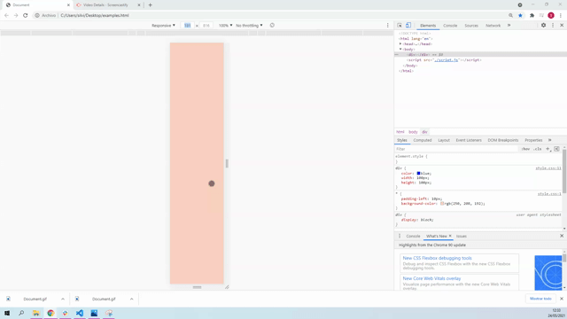

# 5. Mobile first y media queries

## Viewport
***
El viewport define el tamaño de la página que el usuario verá según su dispositivo. Anteriormente las páginas tenían un tamaño fijo, sin embargo, tras la llegada de los móviles y tablets, estas no podían adaptarse al tamaño de las nuevas pantallas, por ello, se creó esta solución. 

Esta capacidad de adaptarse viene refleja en una de las etiquetas meta de html, que nuestra página debería tener por defecto: *<meta name="viewport" content="width=device-width, initial-scale=1.0">* donde *width=device-width* le indica que el ancho de la página debe adaptarse al ancho del dispositivo y *initial-scale=1.0* el zoom con el que se cargará la página al abrirse. 

También fue muy importante la creación de lo que llamamos media queries. Estas nos permiten definir el ancho o el alto que debe tener una pantalla, para aplicarle una serie de propiedades específicas, que cambiarán al cambiar de dispositivo y por lo tanto de media query. 

Las media querys se representan así: *@media* y llevan asociado consigo aquello que quieren verificar: el ancho o el alto del dispositivo, la orientación, la resolución... La sintaxis sería: 

    @media not|only tipo de medio y (expresiones sobre el ancho o el alto...) {
    CSS-Code;
    }

 *not* con not, nos referiremos a todos aquellas medidas que no cumplan con la condición expresada, *only* para señalar que solo cuando el dispositivo tenga esa condición, se le aplicarán los estilos que hemos metido dentro de @media y *and* que lo utilizaremos cuando queramos poner varias expresiones. 

Los tipos de medio que podemos señalar en @media son: 

- **all**: le indicamos que es para todos los medios. 

- **print**: cuando queremos indicarle que el tamaño se lo dará la impresora.

- **screen**: se refiere a ordenadores, tablets, móviles...

- **speech**: para lectores de pantalla que leen la página en alto. 

Respecto a las expresiones, se refieren a una condición en concreto. Las expresiones que más se utilizan se refieren al mínimo y máximo ancho o alto del tamaño en el que se verá el navegador del dispositivo:

- **min-width**: el ancho mínimo con el que se aplicarán las medidas. 

- **max-width**: el ancho máximo.

- **landscape**: en el caso que el ancho de la página sea mayor que el alto, es decir, que se muestre en horizontal. 

Podemos utilizar estas expresiones según lo que nos convenga. La elección vendrá dada según el dispositivo al que esté orientado nuestra página. Dado que el número de dispositivos es muy amplio también lo es las posibles medidas que podríamos poner en las media querys. 

Los valores más comunes varían un poco, dado que en el mercado siempre se están haciendo nuevas innovaciones, aunque las expresiones que solemos tomar como referencia según el tamaño son las siguientes: 

- **Para movil**: no utilizaremos ninguna media query, ya que tomará los valores que posicionamos fuera de los media queries. 

- **Para móviles en horizontal y tablets**: @media(min-width: 768px)

- **Para tablets en horizontal y escritorio**: @media(min-width: 1024px)

- **Escritorios muy anchos**: @media(min-width: 1200px)

Lo óptimo es que en nuestro documento de css, utilicemos distintas media queries, para que nuestra página se adapte a la mayor cantidad de dispositivos. Para ello, utilizaremos la filosofía de **mobile first**. Esta forma de diseñar parte del concepto de que los móviles son los dispositivos que más se utilizan y por lo tanto, el diseño con css debe dar prioridad a este tipo de dispositivos. También es importante esta filosofía ya que el posicionamiento de google favorece a aquellas páginas que la utilizan, ya que significará que estamos utilizando todos los elementos en nuestra página, independientemente del dispositivo en el que se reproduzca y estamos haciendo que la usabilidad de nuestra página sea mayor. 

#### ¿Cómo escribirlo en código?

Por ejemplo, quiero que el fondo de los p cambie, según el dispositivo. Teniendo este código, la forma de utilizar las media queries es así:
```css
    div {
        color: blue;
        width: 100px;
        height: 100px;
    }

    @media only screen and (min-device-width: 320px) and (max-device-width: 480px) {
        div {
            background-color: fuchsia;
            width: 150px;
            height: 150px;
        }
    }

    @media screen and (min-device-width: 481px) and (max-width: 600px) {
        div {
            background-color: slateblue;
            width: 200px;
            height: 200px;
        }
    }

    @media screen and (min-device-width: 601px) and (max-width: 767px) {
        div {
            background-color: palevioletred;
            width: 250px;
            height: 250px;
        }
    }

    @media screen and (min-device-width: 768px) and (max-device-width: 1023px) {
        div {
            background-color: chartreuse;
            width: 300px;
            height: 300px;
        }
    }

    @media screen and (min-device-width: 1024px) {
        div {
            width: 350px;
            height: 350px;
            background-color: seagreen;
        }
    }

```
#### ¿Cómo se vería representado?


#### Recursos

- [Viewport](https://www.w3schools.com/css/css_rwd_viewport.asp)
- [Media Queries](https://www.w3schools.com/css/css_rwd_mediaqueries.asp)
- [Media Queries](https://www.w3schools.com/css/css3_mediaqueries.asp)
- [Media Queries estandar](https://css-tricks.com/snippets/css/media-queries-for-standard-devices/)
- [Listado de media queries para dispositivos](https://www.bufa.es/css3-listado-media-queries/)
- [Distintas posibilidades de las media queries](https://developer.mozilla.org/es/docs/Web/CSS/Media_Queries/Using_media_queries)
- [Media Queries Examples](https://www.w3schools.com/css/css3_mediaqueries_ex.asp)
- [¿Qué es mobile first?](https://www.qualitydevs.com/2019/02/07/que-es-mobile-first-y-por-que-es-importante/)


v 