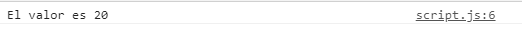
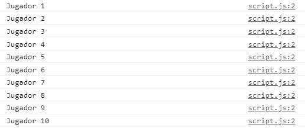
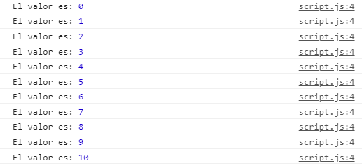
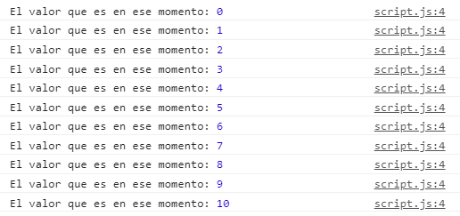

# 1. Variables, condicionales, bucles y operadores 

## *Introducción*

>JavaScript es un lenguaje de secuencias de comandos que te permite crear contenido de actualización dinámica, controlar multimedia, animar imágenes y prácticamente todo lo demás.
-[definición-de-javascript | MDN](https://developer.mozilla.org/es/docs/Learn/JavaScript/First_steps/What_is_JavaScript)

>JavaScript (abreviado comúnmente JS) es un lenguaje de programación interpretado, dialecto del estándar ECMAScript. Se define como orientado a objetos,2​ basado en prototipos, imperativo, débilmente tipado y dinámico.
Se utiliza principalmente del lado del cliente, implementado como parte de un navegador web permitiendo mejoras en la interfaz de usuario y páginas web dinámicas3​ y JavaScript del lado del servidor (Server-side JavaScript o SSJS). Su uso en aplicaciones externas a la web, por ejemplo en documentos PDF, aplicaciones de escritorio (mayoritariamente widgets) es también significativo.
Desde 2012, todos los navegadores modernos soportan completamente ECMAScript 5.1, una versión de JavaScript. Los navegadores más antiguos soportan por lo menos ECMAScript 3. La sexta edición se liberó en julio de 2015.4​
-[qué-es-javascript](https://es.wikipedia.org/wiki/JavaScript)

A lo largo del bootcamp estudiaremos como se utiliza Javascript, primeramente estudiaremos la lógica que presentan la mayoría de lenguajes, centrándonos en la sintaxis de javascript, después las nuevas implementaciones que nos ofrece la versión de Ecmascript 6 y como se utiliza como base de frameworks y de entornos como Node.js.

## *Teoría*

## Variables var / let / const
***
Una variable es un elemento que se utiliza para hacer referencia a un valor. La sintaxis de una variable es la siguiente: 

    variable *nombre de la variable* = valor de la variable. 

Podemos utilizar la palabra var, la palabra let o la palabra const, para referirnos a una variable, como después veremos. De momento para los ejemplos vamos a utilizar la palabra var. Por ejemplo: var saludo = "hola".

Existen distintos valores que podemos asociar a una variable: 

  - **string**: hace referencia a cualquier cadena de texto. Puede ser una palabra o una frase y se representa entre comillas. Las comillas pueden ser simples: "" o dobles: '', y el texto irá dentro de estas comillas. Por ejemplo: var perro = "Kira".

  - **number**: se refiere a cualquier valor numérico. Es imprescindible que para representar una variable de tipo number, utilicemos números y no letras, ya que si no, el programa no lo reconoce. Un ejemplo de una variable numérica sería: var favoriteNumber = 2. 

  - **boolean**: el valor de la variable puede ver true (verdadero) o false (falso). True y false no se escriben entre comillas, ya que son los dos posibles valores que acepta un valor booleano. Ejemplo: var finished = false || var finished = true

  - **undefined**: significa que no tiene asociado ningún valor, ya que no lo hemos definido, por lo tanto, no podremos trabajar con ella. Ejemplo: var favoriteNumber = undefined .

  - **null**: es un tipo de dato. Lo utilizamos para señalar que si tiene valor, pero es un valor vacio.

  - **object**: todos aquellos que heredan de Object. Son array, Date, Promise... Los cuales veremos más adelante.

Para crear una variable, podemos utilizar el término var, el término let o el término const, todo dependerá el uso que le demos a esa variable, sin embargo, estos dos últimos términos se utilizan más actualmente, desde la versión de ecmascript6(ES6). Para saber el alcance que tiene cada variable, debemos conocer que es el scope y cómo afecta a la declaración de variables.

El scope es el ámbito o el sitio donde está definida la variable y el alcance que tiene. Existen diferentes scope, como veremos a continuación:

- **global scope**: la variable está definida fuera de las funciones o de los bloques, y todo el código puede acceder a ella. Esto significa que podemos utilizarla y darle un valor dentro de una función. Eso hará que ese valor que le dimos en la función, dado que la variable está definida fuera sea también un valor global.

- **local scope**: se da cuando una variable es definida dentro de una función. Estas variables solo serán accesibles dentro de ellas, y no podremos acceder a ellas en ninguna otra parte del código.

- **block scope**: las variables son definidas dentro de un bloque de código (no tiene por qué ser una función), y solo serán accesibles en esa parte del código.

- **lexical scope**: en el caso de que tengamos funciones anidadas, las funciones que estén dentro de otras funciones podrán acceder a las variables que tienen las funciones donde fueron encapsuladas, es decir, podrán acceder a las variables definidas en su ámbito padre. 

Conociendo los distintos scope que existen, pasemos a ver la diferencia que hay entre utilizar var, let y const.

- **var**: independientemente de donde se declare la función, su scope será global. Por lo que aunque se declare con un valor, podemos modificarlo en cualquier momento, ya sea dentro de una función o de un bloque, ya que su valor cambiará igualmente.

- **let**: su scope es de bloque, por lo que solo es accesible en esa parte del código. Su valor puede cambiar o transformarse si así se lo indicáramos, y esta será la principal diferencia con const. 

- **const**: aunque también su scope es de bloque, su valor no puede ser reasignado, por lo que lo utilizaremos para definir variables que no van a cambiar. 


#### ¿Cómo escribirlo en código?

    - variables de tipo string: let animal = "caballo"; const dni="01234567A";
    - variables de tipo number: let numero = 2; const id = 5405934;
    - variables de tipo booleano: let finished = false; let finished = true;
    - variables de tipo undefined: let noData = undefined; const noData = undefined;
    - variables de tipo null: let data = null; const data = null;
    - variables de tipo object: let friend = {name: "Luis", age: 25}; const friends = ["Luis", "Laura", "Marcos"]


#### Recursos

[Definición de variable](https://uniwebsidad.com/libros/javascript/capitulo-3/variables#:~:text=Las%20variables%20en%20los%20lenguajes,hacer%20referencia%20a%20otro%20valor.&text=Las%20variables%20en%20JavaScript%20se%20crean%20mediante%20la%20palabra%20reservada%20var%20.)
[Valores de las variables](https://www.todojs.com/tipos-datos-javascript-es6/#:~:text=Javascript%20tiene%20seis%20tipos%20primitivos,%2C%20Date%20%2C%20Promise%20%2C%20etc.)
[Scope y diferencias entre var, let y const](https://platzi.com/blog/como-funciona-el-scope-en-javascript/)
[Diferencias entre var, let y const](https://medium.com/@tatymolys/var-let-y-const-donde-cuando-y-por-qu%C3%A9-d4a0ee66883b)
[Variable var](https://developer.mozilla.org/es/docs/Web/JavaScript/Reference/Statements/var)
[Variable let](https://www.w3schools.com/js/js_let.asp)
[Variable const](https://www.w3schools.com/js/js_const.asp)

## Condicional if else
***
En todos los lenguajes y en concreto en Javascript existe lo que llamamos condicionales. Los condicionales definen el comportamiento que tendrá nuestro código, según si se cumple esa condición o no. Aquí entrará en juego lo que hemos visto sobre los booleanos. En el caso de que se cumpla la condición, el resultado es true, y si no se cumple, será false. 

La forma de escribirlo en código es la siguiente: 

  ```javascript
    if (la condición que queremos que se cumpla para ejecutar ese código) {
      el código que queremos que se ejecute si la condición es verdadera
    } else {
      el código que queremos que se ejecute en todos los demás casos en los que la condición es falsa
    }
  ```

Podemos poner más de una condición dentro de if, para que tengan que cumplirse todas esas condiciones para que se ejecute ese código. Esto lo expresaremos con lo que veremos más adelante (los operadores). Además, podemos distinguir entre distintas condiciones, y según la que se cumpla, es la que ejecutará el código. Esto es posible añadiendo una nueva opción a nuestro código: if else. Podemos poner tantos if else como queramos, pero solo podremos poner un else, en nuestro condicional. Así es como se expresaría: 

  ```javascript
  if (la condición que se tiene que cumplir para ejecutar ese código) {
    el código que queremos que se ejecute si la condición es verdadera
  } else if (otra condición distinta a la anterior que se ejecutará en el caso de que se cumpla) {
    el código que queremos que se ejecutará si la condición es verdadera
  }else {
    el código que queremos que se ejecute en todos los demás casos en los que la condición es falsa
  }
  ```

#### ¿Cómo escribirlo en código?

```javascript
      let name = "Natalia"

      if(name === "Natalia") {
          console.log("Hola " + name)
      } else {
          console.log("Hola, desconocido")
      }
  ```
  
#### ¿Qué resultado obtendríamos?
  


#### ¿Cómo escribirlo en código?

```javascript
      let numero = 20

      if (numero>20){
            console.log("Valor mayor que 20");
        } else if (numero==20){
            console.log("El valor es 20");
        } else {
            console.log("El valor es menor que 20");
        }
  ```
  
  #### ¿Qué resultado obtendríamos?
  


#### Recursos

[Condicionales](https://developer.mozilla.org/es/docs/Learn/JavaScript/Building_blocks/conditionals)
[Else if](https://www.w3schools.com/js/js_if_else.asp)

## Condicional switch
***
Como alternativa al condicional if else, podemos utilizar el condicional switch. Su estructura es algo diferente, y la elección de uno u otro vendrá determinada por la necesidad que tengamos. Como ahora veremos, al ser su sintaxis diferente, también lo será su comportamiento.

Siendo su estructura la siguiente: 

  ```javascript
    switch (la variable que le pasamos){
        case(el valor que haría que se ejecute el código que hay dentro de él):
            …el código que se ejecutará si se cumple la condición…
            break;
        case(el valor que haría que se ejecute el código que hay dentro de él):
            …el código que se ejecutará si se cumple la condición…
            break;
        case(el valor que haría que se ejecute el código que hay dentro de él):
            …el código que se ejecutará si se cumple la condición…
            break;
        default:
            …el código que se ejecutará en todos los casos que no se cumplan los casos anteriores…
            break;
    }
  ```

la forma de lectura es algo diferente, ya que en el caso de if else, tomaría un camino u otro, pero en el caso de switch, tomará el primer camino (o caso) que cumpla la condición que le hemos señalado. Con la palabra break le indicaremos que no siga revisando las condiciones, ya que ha llegado a la que esperaba.  

#### ¿Cómo escribirlo en código?

  ```javascript
    let personaje = "Harry Potter";

    switch (personaje) {
      case "Harry Potter":
        console.log("Eres el protagonista");
        break;
      case "Hermione":
        console.log("Eres amig@ del protagonista");
        break;
      case "Ron":
        console.log("Eres amig@ del protagonista");
        break;
      default:
        console.log("No eres amigo del protagonista");
        break;
    }
  ```

#### ¿Qué resultado obtendríamos?


#### ¿Cómo escribirlo en código?

  ```javascript
    let personaje = "Ron";

    switch (personaje) {
      case "Harry Potter":
        console.log("Eres el protagonista");
        break;
      case "Hermione":
        console.log("Eres amig@ del protagonista");
        break;
      case "Ron":
        console.log("Eres amig@ del protagonista");
        break;
      default:
        console.log("No eres amigo del protagonista");
        break;
    }
  ```

#### ¿Qué resultado obtendríamos?


#### Recursos

[Bucle for](https://www.w3schools.com/js/js_loop_for.asp)
[Bucle while](https://www.w3schools.com/js/js_loop_while.asp)

## Bucle for
***
Los bucles se utilizan cuando queremos que un código se ejecute una y otra vez, de forma repetida, con un valor diferente en cada momento. Existen distintos tipos de bucles for, que utilizaremos según nuestras necesidades, pero todos parten de la base en que hay un código que se ejecutará un número n de veces que nosotros le indiquemos. 

La sintaxis básica de un bucle for es la siguiente: 

  ```javascript
    for (contador; condición de salida; iterador) {
      el código que se ejecuta
    }
  ```

Donde contador determina la variable en el que el bucle for empezará a ejecutarse, la condición de salida hace que el bucle for siga ejecutándose hasta que se cumpla y el iterador que hace que el valor se vaya incrementando

Veamos un ejemplo práctico: 

#### ¿Cómo escribirlo en código?

Por ejemplo, queremos listar el número de jugadores. Sabemos que el número total de jugadores es 10 y que el número empezará en 1. La forma de plantearlo en un bucle for sería: 

  ```javascript
      for (player = 1; player <= 10; player++) {
        console.log("Jugador " + player);
      }
  ```
  
Como verás en el resultado, el número es el que va cambiando. Por ello, los bucles pueden ser muy útil a la hora de trabajar con información que nos viene de otros recursos y que queremos trabajar con ello o que se muestre, como veremos más adelante.


#### ¿Qué resultado obtendríamos?



#### Recursos

[Bucle for](https://www.w3schools.com/js/js_loop_for.asp)

## Bucle while
***
Otro bucle que podemos utilizar es el bucle while. La diferencia con el bucle for reside en que antes de iniciarse comprueba la condición por la que se ejecuta y cada vez que se ejecuta, la condición vuelve a comprobarse.

Su sintáxis es la siguiente: 

  ```javascript
    iniciador; 

    while (contador < el número hasta el que queremos que se cumpla la condición) {
     el código que se ejecuta
    }
  ```


#### ¿Cómo escribirlo en código?

Imaginemos que queremos obtener todos los valores del 1 al 10 incluido empezando por 0. La forma de hacerlo sería la siguiente. 

  ```javascript
    i = 0; 

    while (i <= 10) {
      console.log("El valor es:", i);
      i++
    }
  ```

#### ¿Qué resultado obtendríamos?



[Bucle while](https://www.w3schools.com/js/js_loop_while.asp)


## Bucle do while
***
El bucle do while es una variante del bucle while. La diferencia con este es que primero se ejecuta el código, y después se comprueba la condición. 

Su sintáxis es la siguiente: 

  ```javascript
    iniciador
    do {
      el código a ejecutar

      iterador
    } while (la condición que se debe cumplir para dejar de ejecutarse el código)
  ```

#### ¿Cómo escribirlo en código?

Pongamos el mismo ejemplo de antes, para ver cuál sería el resultado. 

  ```javascript
    i = 0; 

    do {
      console.log("El valor es:", i);
      i++
    }    while (i <= 10) 
  ```

Como ves, es el mismo resultado, sin embargo, el código se ejecuta antes de comprobarse la condición.

#### ¿Qué resultado obtendríamos?



#### Recursos

[Bucle while](https://www.w3schools.com/js/js_loop_while.asp)


## Operadores Lógicos, Operadores de Asignación y Operadores de Comparación
***
Existen una gran variedad de operadores. Su utilidad reside a la hora de utilizarlos en funciones y condicionales, ya que nos permiten tanto asignar como comparar entre variables. 

**Operadores lógicos**:
Veamos en primer lugar los **operadores lógicos**, los cuales son muy útiles a la hora de establecer condiciones. 

- **operador "&&"**: este operador establece que las dos condiciones deben cumplirse. 
- **operador "||"**: al utilizarlo indicaremos que una de las condiciones debe cumplirse.
- **operador "!"**: con él negaremos. Le indicamos que la condición se cumplirá con todos los valores excepto aquellos que le indiquemos que no con este operador.   

#### ¿Cómo escribirlo en código?

  ```javascript
    let nombre = "David";

    if (nombre == "David" && nombre.length == 5) {
      console.log("Hola David");
    } else {
      console.log("No eres David");
    }
  ```

#### ¿Qué resultado obtendríamos


#### ¿Cómo escribirlo en código?

  ```javascript
    let nombre = "David";

    if (nombre == "David" || nombre.length == 20) {
      console.log("Hola David");
    } else {
      console.log("No eres David");
    }
  ```


#### ¿Qué resultado obtendríamos


#### ¿Cómo escribirlo en código?

  ```javascript
    let nombre = "David";

    if (nombre == "David" && nombre.length == 5) {
      console.log("Hola David");
    } else {
      console.log("No eres David");
    }
  ```


#### ¿Qué resultado obtendríamos


**Operadores de asignación**:

Estos asignan valores a las variables que tenemos en javascript. Según el que utilicemos, las variables tendrán un comportamiento determinado. Veamos los distintos operadores que pueden existir, y su comportamiento. 

- **Operador "="**: asigna un valor a la variable. Este operador se utiliza para asignar un valor a la variable, por lo que la construcción de una variable siempre será *variable nombreDeLaVariable = valorDeLaVariable*. Todos los demás operadores se utilizarán cuando la variable ya ha sido declarada. 

- **Operador "+="**: este operador toma la variable que ya ha sido creada y le añade el valor que le indiquemos. La sintaxis sería así: *nombreDelaVariable += valorQueQueremosAñadir*

- **Operador "-="**: dicho operador substrae el valor que le indiquemos. Su sintaxis es la siguiente: *nombreDelaVariable -= valorQueQueremosSubstraer*

- **Operador "\*="**: su función es la de multiplicar el valor de la variable por el valor que le indiquemos. Su sintaxis es la siguiente: *nombreDelaVariable *= valorQueQueremosMultiplicar*

- **Operador "/="**: divide el valor de la variable por el valor que le indiquemos. Su sintaxis es la siguiente: *nombreDelaVariable += valorQueQueremosDividir*

- **Operador "%="**: el resultado que obtendremos con este operador, será el resto de la división. Su sintaxis es la siguiente: *nombreDelaVariable %= valorQueQueremosDarleParaObtenerUnResto*


#### ¿Cómo escribirlo en código?
  ```javascript
    - Operador "=": let example = 20; 
  ```

#### ¿Cómo escribirlo en código?

  ```javascript
    - Operador "+=": example+=5 
  ```

#### ¿Qué resultado obtendríamos


#### ¿Cómo escribirlo en código?

  ```javascript
    - Operador "-=": example-=5
  ```

#### ¿Qué resultado obtendríamos


#### ¿Cómo escribirlo en código?

  ```javascript
    - Operador "*=": example*=5
  ```

#### ¿Qué resultado obtendríamos


#### ¿Cómo escribirlo en código?

  ```javascript
    - Operador "/=": example*=5
  ```

#### ¿Qué resultado obtendríamos


#### ¿Cómo escribirlo en código?

  ```javascript
    - Operador "%=": example/=5
  ```

#### ¿Qué resultado obtendríamos


**Operadores de comparación**:

Este tipo de operadores comparan entre variables o valores para determinar si existe relación o no entre ellos. Si la hay, el resultado será true y si no, el resultado será false. 

- **operador "=="**: establece una comparación entre dos elementos para determinar si tienen el mismo valor. 
- **operador "==="**: comparan si los elementos tienen el mismo valor y son del mismo tipo (string, number, boolean...).
- **operador "!="**: comparan dos elementos. Para que el resultado sea true, no deben tener el mismo valor. 	
- **operador "!=="**: comparan dos elementos que no pueden coindicir ni en valor ni en tipo para que sean verdaderos. 		
- **operador ">"**: un valor de un elemento debe ser mayor que el del otro, para que la relación entre ellos sea verdadera. 
- **operador ">="**: un valor de un elemento debe ser mayor *o igual* que el del otro, para que la relación entre ellos sea verdadera. 
- **operador "<"**: el valor del elemento primero debe ser menor que el valor del segundo. 	- **operador "<="**: el valor del elemento primero debe ser menor *o igual* que el valor del segundo. 

#### ¿Cómo escribirlo en código?


  ```javascript
    let example1 = 10
    let example2 = "10"
    let example3 = 20

    if (example1 == example2) {
      console.log("Cumplen la condición");
    } else {
      console.log("No cumplen la condición");
    }
  ```

#### ¿Qué resultado obtendríamos?


#### ¿Cómo escribirlo en código?

  ```javascript
    let example1 = 10
    let example2 = "10"
    let example3 = 20

    if (example1 === example2) {
      console.log("Cumplen la condición");
    } else {
      console.log("No cumplen la condición");
    }
  ```

#### ¿Qué resultado obtendríamos?


#### ¿Cómo escribirlo en código?

  ```javascript
    let example1 = 10
    let example2 = "10"
    let example3 = 20

    if (example1 !== example2) {
      console.log("Cumplen la condición");
    } else {
      console.log("No cumplen la condición");
    }
  ```

#### ¿Qué resultado obtendríamos?


#### ¿Cómo escribirlo en código?

  ```javascript
    let example1 = 10
    let example2 = "10"
    let example3 = 20

    if (example1 > example3) {
      console.log("Cumplen la condición");
    } else {
      console.log("No cumplen la condición");
    }
  ```

#### ¿Qué resultado obtendríamos?


#### ¿Cómo escribirlo en código?

  ```javascript
    let example1 = 10
    let example2 = "10"
    let example3 = 20

    if (example1 >= example3) {
      console.log("Cumplen la condición");
    } else {
      console.log("No cumplen la condición");
    }
  ```


#### ¿Qué resultado obtendríamos?


#### ¿Cómo escribirlo en código?

  ```javascript
    let example1 = 10
    let example2 = "10"
    let example3 = 20

    if (example1 < example3) {
      console.log("Cumplen la condición");
    } else {
      console.log("No cumplen la condición");
    }
  ```


#### ¿Qué resultado obtendríamos?


#### ¿Cómo escribirlo en código?

  ```javascript
    let example1 = 10
    let example2 = "10"
    let example3 = 20

    if (example1 <= example2) {
      console.log("Cumplen la condición");
    } else {
      console.log("No cumplen la condición");
    }
 ```

#### ¿Qué resultado obtendríamos?


#### Recursos

[Operadores de asignación](https://www.w3schools.com/js/js_assignment.asp)
[Operadores lógicos y comparación](https://www.w3schools.com/js/js_comparisons.asp)


