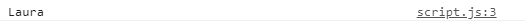
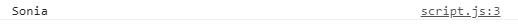
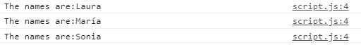
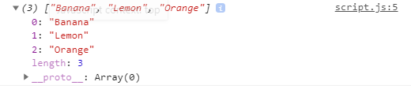
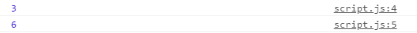
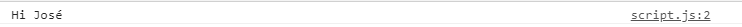
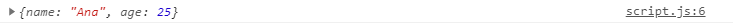
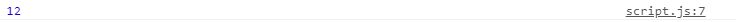

# 2. Arrays y funciones

## Arrays
***
Los arrays nos permiten guardar en ellos varios valores en una sola variable. Su sintaxis será la siguiente: 

  ```javascript
    let nombreDeLaVariable = [elemento1, elemento2, ...]
 ```

El número de elementos que podemos guardar dentro de un array es muy alto, por lo que este tipo de objeto es muy útil para manejar información y almacenarla. Cada elemento del array, ocupa una posición, siendo el primer elemento la posición 0, el segundo la posición 1, el tercero la posición 2... 

Por otro lado, son muchas las acciones que podemos realizar con los arrays. Veamos unas cuantas: 

*Acceder a los elementos del array*:
Para ello, tomaremos el nombre de la variable, y la posición del elemento al que queremos acceder. 

#### ¿Cómo escribirlo en código?

  ```javascript

    let names = ["Laura", "María", "Sonia"];

    Quiero coger el valor del primer elemento: ¿cómo lo hago? 

    console.log(names[0]);

    Si quisiera coger el tercer elemento: 

    console.log(names[2]);
  ```

#### ¿Cómo resultado obtendríamos?




*Obtener todos los elementos del array*:
Si queremos obtener todos los elementos que hay en el array, utilizaremos un bucle. 

#### ¿Cómo escribirlo en código?

  ```javascript
    let names = ["Laura", "María", "Sonia"];

    for (let i = 0; i < names.length; i++) {
    console.log("The names are:" + names[i]);
    }
  ```


#### ¿Cómo resultado obtendríamos?


*Cambiar un elemento del array*:
Para cambiar el valor de uno de los elementos del array, tomaremos el nombre del array, indicándole la posición, y el nuevo valor. 

#### ¿Cómo escribirlo en código?

  ```javascript
    let fruits = ["Banana", "Apple", "Orange"];

    fruits[1] = "Lemon";

    console.log(fruits)
  ```

#### ¿Cómo resultado obtendríamos?


*Propiedad length*:
Para saber la longitud del array, es decir, el número de elemento que tiene, usaremos la propiedad length.

#### ¿Cómo escribirlo en código?

  ```javascript
    let fruits = ["Banana", "Apple", "Orange"];
    let numbers = [1,2,3,4,5,6]

    console.log(fruits.length)
    console.log(numbers.length)
  ```

#### ¿Cómo resultado obtendríamos?



#### Recursos

[Arrays | W3S](https://www.w3schools.com/js/js_arrays.asp)
[Arrays | MDN](https://developer.mozilla.org/es/docs/Web/JavaScript/Reference/Global_Objects/Array)
#### Recursos

## Funciones
***
Una función es un conjunto de instrucciones(llamadas declaraciones) que se ejecutan con unos valores de entrada o argumentos(parámetros) en el cuerpo de la función y devuelve unos valores de salida. 

Todas las funciones devuelven su valor predeterminado, por ello, para devolver el resultado de las instrucciones que hay dentro de la función debemos utilizar la sentencia return, ya que el valor predeterminado para una función es undefined. Su sintaxis es la siguiente: 

  ```javascript
        function nombreDeLaFunción(argumentos) {
            conjunto de declaraciones que se ejecutan

            return valorQueDevuelve
        }
  ```

En Ecmascript 6 se implemento esta forma de escribir las funciones: son las llamadas funciones flecha.

  ```javascript
        const nombreDelaFuncion = (argumentos) => {
            return valoresQueDevuelve
        }
  ```

Por otro lado, podemos declarar las variables de dos formas: 

- Utilizando el constructor Function y asignandole un valor. 

    ```javascript
    function nombreDelaFunción(argumentos) {
        código a ejecutar

        return valorQueDevuelve
        }
   ```
- Declarando una variable y que su valor sea una función (función anónima)

    ```javascript
        let nombredelaVariable = function(argumentos) {
            código a ejecutar

            return valorQueDevuelve
        }
    ```


Por otra parte, debemos tener en cuenta que las funciones deben ejecutarse, y seremos nosotros los que le indicaremos el momento en el que lo debe hacer. Para ello, llamaremos a la función, y al ponerle unos paréntesis la invocaremos, pasándole los argumentos que recibirá la función. Estos serían los ejemplos prácticos: 

#### ¿Cómo escribirlo en código?

  ```javascript
  let sayMyName = function(name) {
    console.log("Hi "+ name )
  }

  sayMyName("José")
  ```
#### ¿Cómo resultado obtendríamos?


#### ¿Cómo escribirlo en código?

  ```javascript
  function myInformation () {
    let info = {
      name: "Ana",
      age: 25
    }
    console.log(info)
  }

  myInformation()
  ```
#### ¿Cómo resultado obtendríamos?


#### ¿Cómo escribirlo en código?

  ```javascript
  function suma (a,b) {
    result = a+b

    return result
  }

  console.log(suma(5,7))
  ```
#### ¿Cómo resultado obtendríamos?


#### ¿Cómo escribirlo en código?

  ```javascript
  const suma = (a,b) => {
    result = a+b

    return result
  }

  console.log(suma(5,7))
  ```
#### ¿Cómo resultado obtendríamos?


#### Recursos

[Funciones | MDN](https://developer.mozilla.org/es/docs/Web/JavaScript/Guide/Functions)
[Funciones | MDN](https://developer.mozilla.org/es/docs/Web/JavaScript/Reference/Functions)
[Funciones](https://www.w3schools.com/js/js_arrow_function.asp)


