# 3. Objetos y métodos

## Objetos
***
Los objetos nos permiten almacenar un conjunto de propiedades dentro de ellos. Estas propiedades vienen expresadas en clave valor, y sus valores pueden ser valores como un string, un number, un boolean... O pueden ser functions, en cuyo caso, su propiedad se llamaría método. Los objetos en javascript heredan las propiedades de Object, lo que nos permite trabajar con él. 

La sintaxis de un objeto es la siguiente: 

```javascript
    let NombreDelObjeto = {
        clave1: valor,
        clave2: valor,
        clase3: valor,
        ...
    }
```

Podemos poner tantas propidades como deseemos. Las acciones que podemos realizar con los objetos son muchas. Veamos unas cuantas: 

*Acceder a la propiedad de un objeto* 

Existen distintas formas de acceder a sus propiedades. 

- **NombreDelObjeto.Propiedad**: para acceder citamos el nombre del objeto seguido de un punto, con la propiedad del valor que queremos obtener. 

- **NombreDelObjeto['Propiedad']**: en vez de utilizar un punto, utilizamos corchetes para envolver a la propiedad de la que queremos obtener el valor. 

#### ¿Cómo escribirlo en código?
```javascript
    let actress = {
        name: "Angelina",
        lastName: "Jolie",
        age: 45,
        childs: true
    }

    console.log(actress.name);
    console.log(actress['age'])
```

#### ¿Cómo se vería representado?

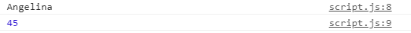

*Utilización de métodos en objetos*
Los métodos son las funciones que incluimos en los objetos. La función debe ser el valor de la propiedad. Esta función ejecutará el código que nosotros le indiquemos y para coger el valor de las propiedades que hay dentro del objeto, utilizará la palabra this. 

#### ¿Cómo escribirlo en código?
```javascript
    let company = {
    name: "YouTube",
    employers: 2000,
    subscribers: 2000000,
    presentation: function () {
        return (
        "Welcome to " + this.name + ". We've got " + this.employers + " employers"
        );
    },
    };

    console.log(company.presentation());
```

#### ¿Cómo se vería representado?

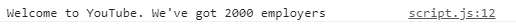


*Borrar propiedades de los objetos*
Para borrar propiedades de un objeto, utilizaremos el operador delete. En él indicaremos el objeto y la propiedad a eliminar.

#### ¿Cómo escribirlo en código?
```javascript
    let company = {
    name: "YouTube",
    employers: 2000,
    subscribers: 2000000,
    presentation: function () {
        return (
        "Welcome to " + this.name + ". We've got " + this.employers + " employers"
        );
    },
    };

    delete company.employers;

    console.log(company);
```

#### ¿Cómo se vería representado?


#### Recursos
[W3S - Objetos](https://www.w3schools.com/js/js_objects.asp)
[MDN - Objetos](https://developer.mozilla.org/es/docs/Web/JavaScript/Guide/Details_of_the_Object_Model)
[MDN - Introducción a objetos](https://developer.mozilla.org/es/docs/Learn/JavaScript/Objects/Basics)
[Objetos | MDN](https://developer.mozilla.org/es/docs/Web/JavaScript/Guide/Working_with_Objects)

## Métodos para string
***
Existen distintos métodos y propiedades de los strings con los que podemos trabajar. Los métodos son muy útiles a la hora de recibir información, ya que nos permitirá verificar, estudiar, extraer datos...

Veamos distintos métodos que podemos utilizar con los strings: 

- *Propiedad length*
Esta propiedad nos permite saber la longitud del string. 

#### ¿Cómo escribirlo en código?
```javascript
    let information = "You shall not pass";

    console.log(information.length);
```

#### ¿Cómo se vería representado?

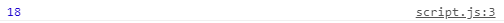


- *Método indexOf()*

Devuelve el índice de la posición en la que comienza el valor que le hemos indicado. Por ello, dentro de los paréntesis le indicaremos el valor que buscamos. En el caso de que hubiera dos valores iguales en el string, tomaría el primero. 

#### ¿Cómo escribirlo en código?

```javascript
    let information = "You shall not pass";

    console.log(information.indexOf("shall"));
```

#### ¿Cómo se vería representado?


- *Método lastindexOf()*
Al igual que el anterior, busca el valor que coindica con el que le hemos indicado en el método, solo que lo que nos devolverá será la posición del último valor que coincida con el que le hemos indicado. 

#### ¿Cómo escribirlo en código?
```javascript
    let information = "You shall not pass because we shall pass together.";

    console.log(information.indexOf("shall", 5));
    console.log(information.search("shall"));
```

#### ¿Cómo se vería representado?

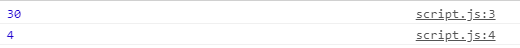


- *Método slice()*
Con este método obtendremos otro string con el nuevo resultado. El nuevo resultado se obtiene de indicarle la posición desde donde queremos que parta el string, hasta dónde queremos que acabe, por lo que tendremos que poner dos argumentos en el método.  

#### ¿Cómo escribirlo en código?
```javascript
    let information = "You shall not pass because we shall pass together.";

    console.log(information.slice(8, 25));
```

#### ¿Cómo se vería representado?

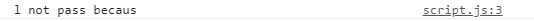


- *Método slice()*
Con este método obtendremos otro string con el nuevo resultado. El nuevo resultado se obtiene de indicarle la posición desde donde quiere cortar el string, hasta dónde quiere cortarlo, por lo que tendremos que poner dos argumentos en el método.  En el caso de que utilizaramos un valor negativo, contaría a partir del final del string. O si solo ponemos un argumento, el string que devolverá empezará a partir del valor de la posición que le hemos indicado. 

#### ¿Cómo escribirlo en código?
```javascript
    let information = "You shall not pass because we shall pass together.";

    console.log(information.slice(8, 25));
```

#### ¿Cómo se vería representado?


- *Método substring()*
Este método es semejante a slice, solo que no podemos utilizar valores negativos. 

#### ¿Cómo escribirlo en código?
```javascript
    let information = "You shall not pass because we shall pass together.";

    console.log(information.slice(-30, -15));
    console.log(information.substring(8, 25));
```

#### ¿Cómo se vería representado?

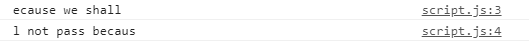


- *Método substr()*
Este método es semejante a slice, sin embargo, el segundo argumento que admite le indica la longitud del string que debe tomar, no la posición. 

#### ¿Cómo escribirlo en código?
```javascript
    let information = "You shall not pass because we shall pass together.";

    console.log(information.substr(8, 5));
```

#### ¿Cómo se vería representado?

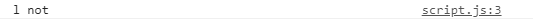


- *Método replace()*
Con este método podemos seleccionar un valor y cambiarlo por otro. Este método solo busca la primera coincidencia con el valor indicado y la reemplaza. 


#### ¿Cómo escribirlo en código?
```javascript
    let information = "You shall not pass because we shall pass together.";

    console.log(information.replace("pass", "sing"));
```

#### ¿Cómo se vería representado?


- *Método toLowerCase()*
Se utiliza para convertir un string que contiene minúsculas y mayúsculas a un texto con todo minúsculas. Para ello, guardaremos el resultado de esta operación en otra variable.  


#### ¿Cómo escribirlo en código?
```javascript
    let information = "Hey! What are you doing? You are scaring me!";

    let newInformation = information.toLowerCase();

    console.log(newInformation);
```

#### ¿Cómo se vería representado?

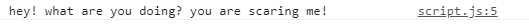


- *Método concat()*
Utilizaremos este método para concatenar dos strings.  


#### ¿Cómo escribirlo en código?
```javascript
    let question = "Hey! What are you doing?";

    let information = "You are scaring me!";

    let newInformation = question.concat(" ", information);

    console.log(newInformation);
```

#### ¿Cómo se vería representado?


#### Recursos

[Métodos para strings](https://www.w3schools.com/js/js_string_methods.asp)


## Métodos para number
***

Al igual que podemos jugar con los strings, también podemos hacerlo con las variables de tipo number. 

- *Método toString()*
Con este método podemos convertir números en strings. 

#### ¿Cómo escribirlo en código?
```javascript
    let number = 2354;
    let numberToString = number.toString();
    console.log(typeof numberToString);
```

#### ¿Cómo se vería representado?

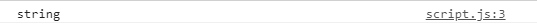

- *Método toFixed()*
Este método se utiliza para especificar el número de decimales que debe tener un número. Puedes servir para limitar el número de decimales o para que todos los valores que nos llegan tengan la misma cantidad de números decimales.  

#### ¿Cómo escribirlo en código?
```javascript
    let number = 23.344054;
    console.log(number.toFixed(2));
    console.log(number.toFixed(4));
    console.log(number.toFixed(10));
```

#### ¿Cómo se vería representado?

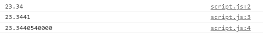


- *Método Number()*
Con este método convertiremos distintos tipos de variables en números. En el caso de que sean strings, si solo tienen carácteres numéricos, podremos convertirlo a número, pero si son otro tipo de caracteres, el resultado que obtendremos será Nan. En el caso de los booleanos, si lo convertimos a número, true será el número 1 y false el número 0. 

#### ¿Cómo escribirlo en código?
```javascript
    console.log(Number("20"));
    console.log(Number("304,23"));
    console.log(Number("Ey"));
    console.log(Number(true));
    console.log(Number(false));
```


#### ¿Cómo se vería representado?

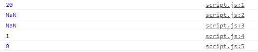


- *Método parseInt()*
Este método toma los strings que solo tienen carácteres numéricos, los convierte en variables de tipo number, tomándo solo el primer conjunto de números (por ejemplo, si hay dos números con dos cifras cada uno, solo tomará el primer número o si hay un número que tiene decimales, solo se quedará con la parte entera). 

#### ¿Cómo escribirlo en código?
```javascript
    console.log(parseInt("2040"));
    console.log(parseInt("304.23"));
    console.log(parseInt("20 45"));
    console.log(parseInt("ey 30"));
```

#### ¿Cómo se vería representado?

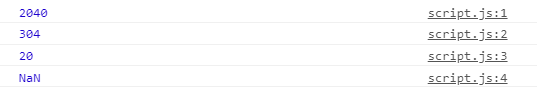


- *Método parseFloat()*
Es igual que el método parteInt, solo que si se queda también con los decimales.

#### ¿Cómo escribirlo en código?
```javascript
    console.log(parseFloat("2040"));
    console.log(parseFloat("304.23"));
    console.log(parseFloat("20 45"));
    console.log(parseFloat("ey 30"));
```

#### ¿Cómo se vería representado?

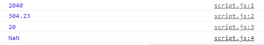


#### Recursos

[Métodos para numbers](https://www.w3schools.com/js/js_number_methods.asp)


## Métodos para arrays
***
Existen distintos métodos para trabajar con los arrays. Veamos algunos: 

- *Método push()*:
Este método añade al array un elemento en la última posición. Para ello, debemos indicar dentro del método, el valor del nuevo elemento que queremos añadir. 

#### ¿Cómo escribirlo en código?
```javascript
    let food = ["Fish", "Meet", "Cheese"];
    food.push("Tomato")

    console.log(food)
```
#### ¿Cómo resultado obtendríamos?
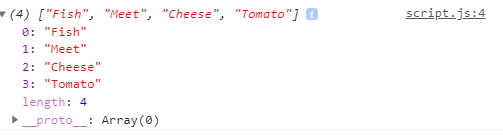


- *Método pop()*:
Con este método eliminaremos el último elemento del array. Por ello, no le indicaremos un valor dentro de los paréntesis.

#### ¿Cómo escribirlo en código?
```javascript
    let food = ["Fish", "Meet", "Cheese"];
    food.pop();

    console.log(food)
```
#### ¿Cómo resultado obtendríamos?
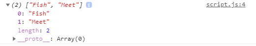


- *Método unshift()*:
Con este método añade un elemento al principio del array, por lo que dentro de los paréntesis debemos indicarle el valor del nuevo elemento que queremos añadir.

#### ¿Cómo escribirlo en código?
```javascript
    let food = ["Fish", "Meet", "Cheese"];
    food.unshift("Pizza");

    console.log(food)
```
#### ¿Cómo resultado obtendríamos?
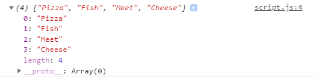


- *Método shift()*:
Este método elimina el elemento que hay en la primera posición del array. En el paréntesis no se le indicará ningún valor. 

#### ¿Cómo escribirlo en código?
```javascript
    let food = ["Fish", "Meet", "Cheese"];
    food.shift();

    console.log(food)
```
#### ¿Cómo resultado obtendríamos?
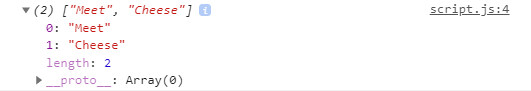


- *Método splice()*:
Este método elimina el elemento que nosotros le indiquemos. Para ello, dentro de los paréntesis debemos indicarle en primer lugar la posición del elemento desde donde se borrarán los elementos y segundo lugar, el número de elementos a eliminar. 

#### ¿Cómo escribirlo en código?
```javascript
    let food = ["Fish", "Meet", "Cheese"];
    food.splice(1,2);

    console.log(food)
```
#### ¿Cómo resultado obtendríamos?
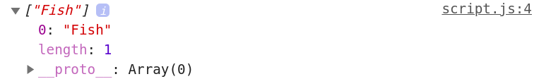


- *Método slice()*
Con este método podemos indicarle la posición del array a partir de la cual queremos que genere un nuevo array a partir de los valores de esa posición. 

#### ¿Cómo escribirlo en código?
```javascript
    let brands = ["Nike", "Addidas", "Puma", "Reebok"];
    console.log(brands.slice(2));
```

#### ¿Cómo se vería representado?

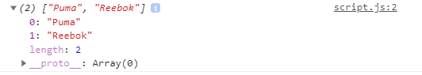

#### Recursos
[Métodos para arrays](https://www.w3schools.com/js/js_array_methods.asp)


- *Método concat()*:
Con este método podemos unir los valores de los dos arrays. Para ello debemos indicarle que cree un nuevo array que tomará el array al que le queremos añadir los valores del otro array. 

#### ¿Cómo escribirlo en código?
```javascript
    let brands = ["Nike", "Addidas"];
    let newBrands = ["Puma", "Reebok"]

    let finishedBrands = brands.concat(newBrands);

    console.log(finishedBrands)
```

#### ¿Cómo resultado obtendríamos?
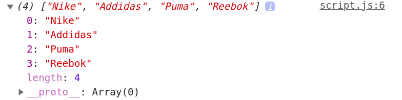


- *Método includes()*:
Este método se utiliza para revisar si en el array existe el valor que estamos buscando. Para ello, debemos poner entre los paréntesis del método, el valor del elemento que buscamos.  

#### ¿Cómo escribirlo en código?
```javascript
    let brands = ["Nike", "Addidas","Puma", "Reebok"];

    let verify = brands.includes("Puma");

    console.log(verify)
```

#### ¿Cómo resultado obtendríamos?


- *Método toString()*
Este método también podemos usarlo con arrays, para convertir la información que nos llega del array en un string. 

#### ¿Cómo escribirlo en código?
```javascript
    let brands = ["Nike", "Addidas","Puma", "Reebok"];
    console.log(brands.toString())
```

#### ¿Cómo se vería representado?


- *Método join()*
Este método es igual que el método toString(), solo que con él podemos indicarle que elemento de separación queremos utilizar. Como verás en el ejemplo, el método join también respeta los espacios.

#### ¿Cómo escribirlo en código?
```javascript
    let brands = ["Nike", "Addidas", "Puma", "Reebok"];
    console.log(brands.join(", "));
    console.log(brands.join(" & "));
```
#### ¿Cómo se vería representado?

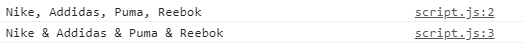


