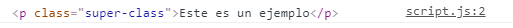
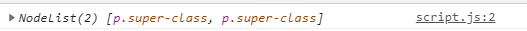
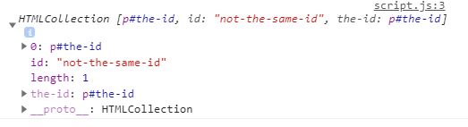
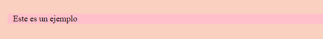
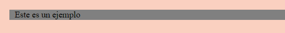
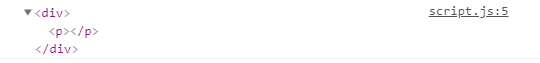
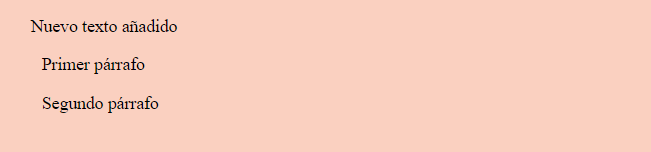
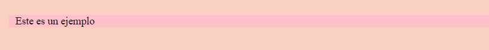
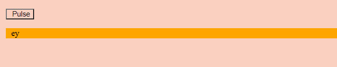

# 4. DOM, eventos, nodos y navegación

## ¿Qué es el DOM de HTML y para qué sirve? 
***
El DOM nos permite manipular elementos de HTML. Es un estándar que utilizamos para acceder a los documentos que se han creado en HTML. Al cargarse la página se crea lo que llamamos DOM (Document Object Model), que es un árbol de Objetos los cuales son los distintos elementos (o etiquetas) que nosotros hemos creado o estamos creando al manipular el DOM, es decir, todos los elementos en HTML son objetos. 

La manipulación del DOM es útil para cambiar estilos, añadir nuevos elementos, eventos... Gracias a que el HTML se crea a partir de este estándar (DOM), podemos manejarlo con javascript y por lo tanto utilizar propiedades, métodos y eventos para trabajar con él. 

Veamos a continuación cómo se vería representado un árbol DOM al cargarse. 

#### ¿Cómo se vería representado?


## Métodos y propiedades del DOM
***
Los métodos del DOM son las funciones que harán que podamos manipular el DOM, es decir, los elementos que hay en HTML y las propiedades son los valores de los elementos de HTML que se pueden modificar. Existen distintos métodos que veremos a continuación. 

Los métodos los aplicaremos al objeto Document, que como vimos anteriormente, es a partir de donde se crea el árbol DOM. Aplicando métodos al Objeto desde donde se construye el arbol, podremos acceder a todas sus propiedades y elementos. 

### Para encontrar elementos de HTML:
***
Tenemos por un lado aquellos métodos que se encargan de encontrar elementos de HTML. 
Podemos encontrarlos por su id, por el nombre de su etiqueta, por su clase, por un selector de CSS... 

- **document.getElementById()**: encuentra un elemento por su id. Para ello, la etiqueta que buscamos debe llevar el atributo id con un valor asociado. Buscaremos ese valor. 

#### ¿Cómo escribirlo en código?
```html
    <body>
        <p id="the-id">Este es un ejemplo</p>
    </body>
```
```javascript
let elementWithId = document.getElementById("the-id");
console.log(elementWithId)
```

#### ¿Cómo resultado obtendríamos?


- **document.getElementsByTagName()**: podemos encontrar los elementos también por el nombre de su etiqueta. 

```html
    <body>
        <p>Este es un ejemplo</p>
        <p>Este es otro ejemplo</p>
        <p>Este es otro ejemplo también</p>
    </body>
```
```javascript
let pElements= document.getElementsByTagName("p");
console.log(pElements)
```

#### ¿Cómo resultado obtendríamos?


- **document.getElementsByClassName()**: por otra parte podemos buscar aquellos que tengan una clase concreta, independientemente si es solo uno o varias etiquetas la que la tengan.  

```html
    <body>
        <p class="super-class">Este es un ejemplo</p>
        <p class="not-super-class">Este es otro ejemplo</p>
        <p class="super-class">Este es otro ejemplo también</p>
    </body>
```
```javascript
let superElements= document.getElementsByClassName("super-class");
console.log(superElements)
```

#### ¿Cómo resultado obtendríamos?


- **document.querySelector()**: con este método podemos seleccionar el primer elemento que encuentre en el árbol DOM con la clase, id, tipo, atributo que nosotros le indiquemos.  

```html
    <body>
        <p class="super-class">Este es un ejemplo</p>
        <p class="not-super-class">Este es otro ejemplo</p>
        <p class="super-class">Este es otro ejemplo también</p>
    </body>
```
```javascript
let superElement = document.querySelector("p.super-class");
console.log(superElement);
```

#### ¿Cómo resultado obtendríamos?



- **document.querySelectorAll()**: este método es igual que el anterior solo que encuentra todas las coincidencias que hay, no solo la primera.  

```html
    <body>
        <p class="super-class">Este es un ejemplo</p>
        <p class="not-super-class">Este es otro ejemplo</p>
        <p class="super-class">Este es otro ejemplo también</p>
    </body>
```
```javascript
let superElements = document.querySelectorAll("p.super-class");
console.log(superElements);
```

#### ¿Cómo resultado obtendríamos?




### Para modificar elementos de HTML:
***
No solo podemos encontrar elementos en HTML si no también modificarlos. Podemos cambiar sus valores, su texto, su estilo, sus atributos... 

- **innerHTML**: podemos usar esta propiedad para modificar el contenido de la etiqueta seleccionada. Para ello usaremos el selector que más se adapte a nuestra necesidad y usaremos esta propiedad. 

#### ¿Cómo escribirlo en código?
```html
    <body>
        <p id="the-id">Este es un ejemplo</p>
    </body>
```
```javascript
document.getElementById("the-id").innerHTML = "Ya no es el mismo ejemplo";

console.log(document.getElementById("the-id"))
```

#### ¿Cómo resultado obtendríamos?


- **attribute**: con esta propiedad podemos modificar que valor del atributo que teniamos. 

#### ¿Cómo escribirlo en código?
```html
    <body>
        <p id="the-id">Este es un ejemplo</p>
    </body>
```
```javascript
document.getElementsByTagName("p").id = "not-the-same-id";

console.log(document.getElementsByTagName("p"));
```

#### ¿Cómo resultado obtendríamos?



- **style.property**: con esta propiedad podemos modificar el valor de una propiedad de css que queramos cambiar. 

#### ¿Cómo escribirlo en código?
```html
    <body>
        <p id="the-id">Este es un ejemplo</p>
    </body>
```
```css
    p {
        background-color: yellow; 
    }
```
```javascript
document.getElementById("the-id").style.backgroundColor = "pink";
```

#### ¿Cómo se vería representado?



- **setAttribute(atributo,valor)**: con este método podemos cambiar el valor del atributo de un elemento. 

#### ¿Cómo escribirlo en código?
```html
    <body>
        <p id="the-id">Este es un ejemplo</p>
    </body>
```
```css
    #the-id {
        background-color: green; 
    }
    #other-id {
        background-color: grey; 
    }
```
```javascript
document.getElementById("the-id").setAttribute("id", "other-id");

```

#### ¿Cómo resultado obtendríamos?




### Para añadir o borrar elementos de HTML:
***
Además de modificar podemos añadir, borrar o reemplazar en html con métodos del DOM, utilizando métodos de document. 

- **document.createElement()**: con él le indicaremos el elemento que deseamos crear con HTML. Para ello le indicaremos el nombre de la etiqueta y el sitio donde debe crearlo. 

#### ¿Cómo escribirlo en código?
```html
    <body>
        <div id="creating"></div>
    </body>
```
```javascript
    let newDiv= document.createElement('div');
    let newP = document.createElement('p');
```

#### ¿Cómo resultado obtendríamos?

No veriamos nada representado, ya que no hemos anexado a ningún elemento que ya esté presente en el html.

- **document.appendChild()**: este método nos permite incluir dentro de un elementro otro elemento. Por ejemplo, dentro de una section un p, o dentro de una ul, varios li... 

#### ¿Cómo escribirlo en código?
```html
    <body>
        <div id="creating"></div>
    </body>
```
```javascript
    let newDiv= document.createElement('div');
    let newP = document.createElement('p');
    newDiv.appendChild(newP);

    console.log(newDiv)

```

#### ¿Cómo resultado obtendríamos?




- **document.insertBefore()**: podemos utilizarlo para insertar antes del elemento que ya existe, otro elemento. 

#### ¿Cómo escribirlo en código?
```html
    <body>
    <div>
      <p id="first">Primer párrafo</p>
      <p id="second">Segundo párrafo</p>
    </div>
    </body>
```
```javascript

// Creamos el elemento
let newP = document
  .createElement("p")
  .appendChild(document.createTextNode("Nuevo texto añadido"));

// Seleccionamos el elemento donde queremos que vaya antes
let information = document.getElementById("first");

//Seleccionamos el elemento donde queremos que vaya
document.getElementById("information").insertBefore(newP, information);

```

#### ¿Cómo resultado obtendríamos?




- **replaceChild()**: este método reemplaza un nodo por otro.  

#### ¿Cómo escribirlo en código?
```html
    <body>
    <div>
      <p id="first">Primer párrafo</p>
      <p id="second">Segundo párrafo</p>
    </div>
    </body>
```
```javascript
// Creamos el elemento
let newP = document
  .createElement("p")
  .appendChild(document.createTextNode("Nuevo texto añadido"));

// Seleccionamos el elemento donde queremos que vaya antes
let information = document.getElementById("first");

//Seleccionamos el elemento donde queremos que vaya
document.getElementById("information").replaceChild(newP, information);

```

#### ¿Cómo resultado obtendríamos?


- **document.removeChild()**: con este método seremos capaces de borrar un elemento. 

#### ¿Cómo escribirlo en código?
```html
    <body>
        <p id="the-id">Este es un ejemplo</p>
    </body>
```
```javascript
document.removeChild(document.getElementById("the-id"));
```

#### ¿Cómo resultado obtendríamos?


- **attribute**: con esta propiedad podemos modificar que valor del atributo que teniamos. 

#### ¿Cómo resultado obtendríamos?


#### Recursos
- [DOM HTML](https://www.w3schools.com/js/js_htmldom.asp)
- [Métodos HTML](https://www.w3schools.com/js/js_htmldom_methods.asp)
- [DOM - Document](https://www.w3schools.com/js/js_htmldom_document.asp)
- [DOM - Element](https://www.w3schools.com/js/js_htmldom_elements.asp)
- [DOM - HTML](https://www.w3schools.com/js/js_htmldom_html.asp)
- [DOM- HTML](http://www.codexexempla.org/curso/curso_4_3_d.php)

## Eventos 
*** 
¿Para qué puede ser útil tener tantos selectores que hagan acciones? Son útiles cuando los utilizamos con los eventos. Los eventos se producen cuando ocurre una acción que es llevada a cabo por el usuario (como por ejemplo hacer click o pasar el ratón por encima). 

Los eventos deben asignarse a una etiqueta en concreto, por lo que el evento se pondrá como atributo de la etiqueta, siendo su valor, la función a ejecutar. Por ejemplo, si queremos pulsar un botón que cambie de color el texto, debemos poner el evento como atributo y la función que ejecuta el cambio de color en el script. 

Otra forma de hacerlo es asociando un evento a una etiqueta a través del DOM, con los selectores que hemos visto anteriormente. Existen muchos tipos de eventos, el cual escogeremos según la necesidad que tengamos. 

Aquí tienes una lista de todos los eventos que existen en el DOM: https://www.w3schools.com/jsref/dom_obj_event.asp. Como ves hay una gran variedad, aunque existen algunos más comunes:

- **click**: este evento se produce cuando el usuario pulsa sobre algún elemento.
- **change**: este evento ocurre cuando el contenido que hay dentro de un input cambia. 
- **mousedown**: este evento se produce cuando el usuario está presionando con el puntero el elemento al que hemos asociado este evento. 
- **mouseenter**: el evento ocurre cuando el ratón del usuario pasa por encima del elemento al que hemos asociado el evento. 
- **mouseleave**: el evento se produce cuando el usuario que había pasado el ratón por encima del elemento, deja de hacerlo. 
- **mouseover**: este evento tiene el mismo comportamiento que mouseenter, a diferencia de que tiene también en cuenta a sus hijos para esa acción. 
- **mouseout**: este evento tiene el mismo comportamiento que mouseleave, a diferencia de que tiene también en cuenta a sus hijos para esa acción. 
- **mouseUp**: este evento se produce cuando el usuario deja de pulsar el elemento al que hemos asociado el evento. Si volviéramos a presionar sobre él, el evento ya no se produciría hasta que de nuevo, se dejara de presionar el elemento.  
- **scroll**: el evento se produce cuando el usuario baja la barra de navegación. 
- **submit**: este evento se produce cuando el usuario envía un formulario, pulsando el botón de typo submit. 

Debemos tener en cuenta algo muy importante, y es que en el caso de que añadamos los eventos directamente como atributo a la etiqueta en html, los eventos llevarán asociado un prefijo: on. En el caso de que lo hagamos con javascript, no utilizaremos ese prefijo.

Para añadir un evento a un elemento por javascript existe el método addEventListener(), el cual es capaz de controlar si ese evento se produce. Es lo que llamaríamos un detector o escuchador de eventos, que está esperando a que la acción se produzca para ejecutar la acción que nosotros le indicamos. 


#### ¿Cómo escribirlo en código?
En el caso de que añadamos el evento directamente como atributo
```html
    <p onClick="changeColor(this)">Este es un ejemplo</p>
```
```javascript
    <script>
      function changeColor(a) {
        a.style.backgroundColor = "pink";
      }
    </script>
```

#### ¿Cómo resultado obtendríamos?



#### ¿Cómo escribirlo en código?
Si queremos seleccionar un elemento con javascript, lo podemos hacer de la siguiente manera.

```html
    <button id="my-btn">Pulse</button>
    <p id="my-paragraph"></p>
```
```javascript
    <script>
      let paragraph = document.getElementById("my-paragraph");

      let btn = document.getElementById("my-btn");

      btn.onclick = changeText;

      function changeText() {
        paragraph.innerHTML = "ey";
        paragraph.style.backgroundColor = "orange";
      }
    </script>
```

#### ¿Cómo resultado obtendríamos?



#### ¿Cómo escribirlo en código?

```html
  </img>
    </img>
```
```javascript
      let cherryTree = document.getElementById("cerezo");

      cherryTree.addEventListener("mouseover", changeDimensions);
     
      function changeDimensions() {
        cherryTree.style.height = "100px";
        cherryTree.style.width = "100px";
      }
```

#### ¿Cómo resultado obtendríamos?
En el caso de que utilicemos addEventListener(). Aquí podemos ver que a la primera imagen se le pasó el ratón por encima, y a la segunda no.


#### ¿Cómo escribirlo en código?

```html
  </img>
```
```javascript
    let cherryTree = document.getElementById("cerezo");

    cherryTree.addEventListener("mouseout", function makeBig() {
            cherryTree.style.height = "300px";
            cherryTree.style.width = "300px";
});
    cherryTree.addEventListener("mouseover", function makeLittle() {
            cherryTree.style.height = "50px";
            cherryTree.style.width = "50px";
});
     
```

#### ¿Cómo resultado obtendríamos?
En la primera imagen vemos su tamaño por defecto. En la segunda su tamaño cuando el cursor está encima y en la tercera cuando el cursor ya no está encima.


#### Recursos 
- [DOM - Events](https://www.w3schools.com/js/js_htmldom_events.asp)
- [DOM - addEventListener](https://www.w3schools.com/js/js_htmldom_eventlistener.asp)


