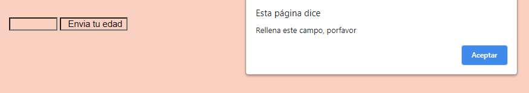
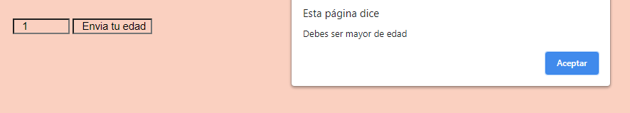
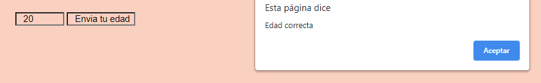
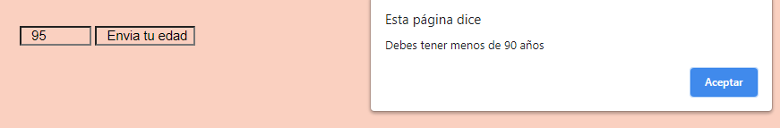

# 5. Formularios

## Formularios
Existen distintos tipos de validaciones de un formulario según el tipo de input que queramos validar o el tipo de valor que queremos que tenga nuestro input. 

Para seleccionar el input que buscamos, podemos hacerlo accediendo a una propiedad de Document, llamada forms, el cual nos devuelve una lista de todos los elementos que tenemos en el arbol DOM. Podemos además señalarle el atributo name, para conocer el valor que se escribió en el input: 

```javascript
    document.forms[elvalordelnombrequeledimosalformulario][elvalordelnombrequeledimosalinputname].value;
```

Veamos distintos tipos de validaciones que podemos aplicar a nuestros formularios: 

- **Validar que un input no esté vacio**: 

Para ello, tendríamos que verificar que el valor del input que se envía no sea un campo vacío. Lo haríamos de la siguiente forma. 

#### ¿Cómo escribirlo en código?
```html
    <form
      name="the-form"
      action="/action_page.php"
      onsubmit="return validateInput()"
      method="post"
    >
      <label id="your-name">Tu nombre:</label>
      <input type="text" name="your-name" id="your-name" />
      <input type="submit" value="Submit" />
    </form>
```
```javascript
      function validateInput() {
        let name = document.forms["the-form"]["your-name"].value;
        if (name == "") {
          alert("Debes rellenar este campo");
          return false;
        }
      }
```

#### ¿Cómo se vería representado?


- **Validar que el valor del input de tipo number que nos llega cumple con los requisitos**:

Aunque podemos validarlo con HTML, indicándole un número mínimo y un número máximo, podemos también verificarlo con una función. Podemos verificar si es un número y si está dentro del rango que le hemos indicado. 

#### ¿Cómo escribirlo en código?
```html
    <input type="number" name="age" id="your-age" min="18" max="90" />
    <button onClick="validateAge()">Envia tu edad</button>
```
```javascript
      function validateAge() {
        var x, text;

        // Get the value of the input field with id="numb"
        let age = document.getElementById("your-age").value;

        // If x is Not a Number or less than one or greater than 10
        if (isNaN(age) || age == "") {
          alert("Rellena este campo, porfavor");
        } else {
          if (age < 18) {
            alert("Debes ser mayor de edad");
          } else if (age > 90) {
            alert("Debes tener menos de 90 años");
          } else {
            alert("Edad correcta");
          }
        }
      }
```

#### ¿Cómo se vería representado?





- **Validación de inputs con HTML** 
Existen unos atributos específicos que podemos incluir en los inputs de nuestro formulario, y nos permitirán validar también información. Es importante que a parte de estas validaciones que ponemos en HTML pongamos validación con javascript, ya que el código de HTML es mucho más accesible en el navegador, para una persona externa que busca saltarse estas validaciones.

Los atributos son:

1. **disabled**: este atributo hace que el input esté deshabilitado y no se pueda escribir sobre él. Un ejemplo en el que se pondría sería cuando la cuenta de un usuario está asociada a un email, el email sería un campo que está deshabilitado en el perfil de la persona, ya que no podría cambiarlo.
2. **max**: indica el valor numérico máximo que puede tener el input.
3. **min**: con este atributo le indicamos el mínimo valor numérico que debe tener el input, ya sea un valor numérico o referido al tamaño. 
4. **maxlength**: con él le indicamos el tamaño máximo del valor que debe tener el input.
5. **minlength**: con él le indicamos el tamaño mínimo del valor que debe tener el input.
6. **pattern**: indica la expresión regular que debe cumplir el input para poder enviarse (las expresiones regulares definen el tipo de caracteres que pueden usarse, el número mínimo, si son mayúsculas o minúsculas...).
7. **required**: con este atributo hacemos que sea obligatorio que el usuario le haya dado un valor al input, para poder enviarse. 
8. **type**: debemos indicarle el tipo de input, ya que si le indicamos el tipo, los valores que podrán meterse según el tipo de input serán diferente, lo que nos permitirá restringir el tipo de valor que queremos usar.

** Contamos también con pseudo selectores de css que le dan un estilo u otro según las verificaciones realizadas. Veamos los más comunes:

1. **:disabled**: selecciona aquellos elementos que tengan el atributo disabled.
2. **:invalid**: selecciona aquellos elementos que tengan valores inválidos (se puede utilizar para cambiar por ejemplo el fondo del input en el caso de que el valor no sea válido, para llamar la atención del usuario).
3. **:optional**: selecciona todos aquellos inputs que no tengan el atributo required.
4. **required**: selecciona aquellos inputs con el atributo required.
5. **valid**: selecciona aquellos inputs que tengan valores válidos.  

- **Validación con propiedades disponibles en el DOM**: 
Nos permite verificar la validez de los input según las restricciones que hemos puesto. 

Esta API que usamos para validar contiene varias propiedades y métodos para verificar los inputs. 

Respecto a las **propiedades** contamos con estas tres: 

- **validity**: es una propiedad que contiene un objeto llamado *ValidityState*, el cual tiene varias propiedades que podemos utilizar para verificar si es válido el elemento. Las propiedades más comunes de este objeto son:  

  - **patternMismatch**: verifica si se cumple el requisito de la expresión regular que le indicamos en el atributo pattern. Si no se cumple, esta propiedad será true, si lo cumple, será false. 

  - **tooLong**: con él validaremos si cumple el requisito de la longitud máxima del valor numérico (atributo max) que le hemos especificado. Si no cumple el requisito, esta propiedad será true y si lo cumple, será false. 
  
  - **tooShort**: con él verificaremos si se cumple el requisito de longitud mínima del valor numérico (atributo min). En el caso de que no se cumpla el requisito, esta propiedad será true, si lo cumple, entonces será false. 

  - **rangeOverflow**: con esta propiedad verificaremos si cumple el requisito de la longitud máxima del valor numérico (atributo max) que le hemos especificado. En el caso de que el valor sea más alto que el máximo indicado, esta propiedad será true, en el caso de que el valor esté por debajo o sea el valor del indicado, esta propiedad será false.  

  - **rangeUnderflow**: con esta propiedad verificaremos si cumple el requisito de la longitud mínima del valor numérico (atributo max) que le hemos especificado. En el caso de que el valor sea más bajo que el mínimo indicado, esta propiedad será true, en el caso de que el valor esté por encima o sea el valor del indicado, esta propiedad será false.  

  - **typeMismatch**: verificamos si se cumple el requisito impuesto por indicarle el tipo de input. Por ejemplo, si el valor del input de tipo email o url no es el correcto, esta propiedad será true, si lo es, entonces esta propiedad será false. 

  - **valid**: verifica si todos los requisitos se cumplen. En el caso de que así sea, esta propiedad será true, si no lo es, la propiedad será false. 

  - **valueMissing**: verifica si el input que tenía un atributo required no tiene valor. En el caso de no tenerlo, esta propiedad es true, si lo tiene esta propiedad será false.

- **validationMessage**: esta propiedad nos permite verificar si se cumplen todos los requisitos. En el caso de cumplirlo, devuelve un string vacío y en el caso de que no, devolverá un mensaje indicando aquella validación que no cumple. 

- **willValidate**: es parecido al anterior, sin embargo, verifica si cumple con todos los requisitos de validación o no. Si no las cumple, su valor será true y en el caso de que si las cumpla, será false. 


Los **métodos** con los que cuenta esta api son los siguientes: 
- **checkValidity()**: verifica si el valor cumple con las restricciones que le hemos indicado. En el caso de que los valores no cumplan con las indicaciones, devolverá falso. En el caso de que sí lo cumpla, su valor será verdadero. 
- **reportValidity()**: es igual que el anterior, pero en el caso de que su valor sea falso indica el posible error que se haya podido producir. 
- **setCustomValidity()**: verifica si se cumplen los requisitos y en el caso de no cumplirlo, envía al usuario una serie de mensajes informándole de por qué el valor no es válido. 

#### Recursos
-[MDN - Validación de formularios](https://developer.mozilla.org/es/docs/Learn/Forms/Form_validation)


